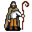

# { .sprite } Tinlyn

**Where to find Tinlyn:** Crossroads Guardhouse: [fields6](../maps/fields6.md#pin-npc-tinlyn)

<div class="infobox" markdown>

<p class="ib-img">{ .sprite }</p>

| | |
|---|---|
| **Type** | NPC (can be spoken to; cannot be attacked) |
| **Role** | Starts [Lost sheep](../quests/tinlyn.md) |
| **Found in** | Crossroads Guardhouse |
| **Entry ID** | `tinlyn` |
| **Introduced** | v0.7.0 or earlier |

</div>

## Quests

- [It makes no fence](../quests/tunlon_fence.md): stages 100, 110
- [Lost sheep](../quests/tinlyn.md): stages 10, 15, 30, 31, 60

## Dialogue simulator

Set the quest stages, items and other conditions that apply to your game, then start the conversation with Tinlyn. The simulator applies the game's own rules: it performs the same silent checks, offers only the options that would be shown in the game, and applies their effects (quest stages, items handed over, rewards) as the conversation proceeds.

<div class="dlg-sim" data-src="../../assets/dialogue/tinlyn.json" data-npc="Tinlyn" markdown="0"><noscript>The simulator needs JavaScript. The full dialogue is listed below.</noscript></div>

<p class="verified">Rules verified against v0.8.18 game code (ConversationController.java) and dialogue data.</p>

??? quote "Dialogue (24 lines)"

    *What the dialogue says, exactly as in the game files. Lines are listed once; links jump to the line a choice leads to.*

    <span id="d-tinlyn"></span>**`tinlyn`** *(silent check: the first matching branch below is taken)*

    - branch 1 *(if reached stage 21 of [Cheap cuts](../quests/benbyr.md#stage-21))* → [tinlyn_killedsheep_0](#d-tinlyn_killedsheep_0)
    - branch 2 *(if reached stage 60 of [Lost sheep](../quests/tinlyn.md#stage-60))* → [tinlyn_killedsheep_0](#d-tinlyn_killedsheep_0)
    - branch 3 *(if reached stage 31 of [Lost sheep](../quests/tinlyn.md#stage-31))* → [tinlyn_complete_1](#d-tinlyn_complete_1)
    - branch 4 *(if reached stage 30 of [Lost sheep](../quests/tinlyn.md#stage-30))* → [tinlyn_complete_1](#d-tinlyn_complete_1)
    - branch 5 *(if reached stage 15 of [Lost sheep](../quests/tinlyn.md#stage-15))* → [tinlyn_look_1](#d-tinlyn_look_1)
    - branch 6 → [tinlyn_story_1](#d-tinlyn_story_1)

    <span id="d-tinlyn_killedsheep_0"></span>**`tinlyn_killedsheep_0`** *(silent check: the first matching branch below is taken)*

    - branch 1 *(if reached stage 10 of [Lost sheep](../quests/tinlyn.md#stage-10))* → [tinlyn_killedsheep_0_1](#d-tinlyn_killedsheep_0_1)
    - branch 2 → [tinlyn_killedsheep_1](#d-tinlyn_killedsheep_1)

    <span id="d-tinlyn_complete_1"></span>**`tinlyn_complete_1`** Tinlyn: “Hello again. Thank you for helping me find my lost sheep.”

    - “I talked to Benbyr and heard the story about you two.” *(if reached stage 10 of [Cheap cuts](../quests/benbyr.md#stage-10))* → [tinlyn_benbyr_1](#d-tinlyn_benbyr_1)
    - “Your brother has sent me to ask where I could get fences from. Do you maybe know?” *(if reached stage 40 of [It makes no fence](../quests/tunlon_fence.md#stage-40); NOT reached stage 100 of [It makes no fence](../quests/tunlon_fence.md#stage-100); NOT reached stage 110 of [It makes no fence](../quests/tunlon_fence.md#stage-110))* → [tinlyn_fence_1](#d-tinlyn_fence_1)

    <span id="d-tinlyn_look_1"></span>**`tinlyn_look_1`** Tinlyn: “Hello again. Did you find all four of my missing sheep?”

    - “Yes, I found all of them.” *(if reached stage 25 of [Lost sheep](../quests/tinlyn.md#stage-25))* → [tinlyn_found_1](#d-tinlyn_found_1)
    - “Not yet. I am still looking.” → [tinlyn_story_6](#d-tinlyn_story_6)
    - “What was I supposed to do?” → [tinlyn_story_2](#d-tinlyn_story_2)
    - “I talked to Benbyr and heard the story about you two.” *(if reached stage 10 of [Cheap cuts](../quests/benbyr.md#stage-10))* → [tinlyn_benbyr_1](#d-tinlyn_benbyr_1)

    <span id="d-tinlyn_story_1"></span>**`tinlyn_story_1`** Tinlyn: “Hello there. You wouldn't happen to want to help an old shepherd would you?”

    - “What's the problem?” → [tinlyn_story_2](#d-tinlyn_story_2)
    - “Your brother has sent me to ask where I could get fences from. Do you maybe know?” *(if reached stage 40 of [It makes no fence](../quests/tunlon_fence.md#stage-40); NOT reached stage 100 of [It makes no fence](../quests/tunlon_fence.md#stage-100); NOT reached stage 110 of [It makes no fence](../quests/tunlon_fence.md#stage-110))* → [tinlyn_fence_1](#d-tinlyn_fence_1)

    <span id="d-tinlyn_killedsheep_0_1"></span>**`tinlyn_killedsheep_0_1`** *(silent check: the first matching branch below is taken)* — **effects:** sets stage 60 of [Lost sheep](../quests/tinlyn.md#stage-60)

    - branch 1 → [tinlyn_killedsheep_1](#d-tinlyn_killedsheep_1)

    <span id="d-tinlyn_killedsheep_1"></span>**`tinlyn_killedsheep_1`** Tinlyn: “You attacked my sheep! Get away from me you filthy murderer!”

    - “I am sorry. But your brother sent me to ask if you knew where I could get fences for his sheep.” *(if reached stage 40 of [It makes no fence](../quests/tunlon_fence.md#stage-40); NOT reached stage 100 of [It makes no fence](../quests/tunlon_fence.md#stage-100); NOT reached stage 110 of [It makes no fence](../quests/tunlon_fence.md#stage-110))* → [tinlyn_fence_2](#d-tinlyn_fence_2)

    <span id="d-tinlyn_benbyr_1"></span>**`tinlyn_benbyr_1`** Tinlyn: “Is he still around? I thought the guards got the best of him.”

    - Next → [tinlyn_benbyr_2](#d-tinlyn_benbyr_2)

    <span id="d-tinlyn_fence_1"></span>**`tinlyn_fence_1`** Tinlyn: “Tunlon? So he's still alive after all. I haven't heard from him in years.”

    - “Yes. And he made me ask you if you knew where you could get fences from.” → [tinlyn_fence_1a](#d-tinlyn_fence_1a)

    <span id="d-tinlyn_found_1"></span>**`tinlyn_found_1`** Tinlyn: “Yes, I can hear distant sounds of bells from the fields to the south. I am sure they will come back here now that they have the bells on them.”

    - “I am happy to help.” → [tinlyn_found_3](#d-tinlyn_found_3)
    - “That was some hard work. What about a reward?” → [tinlyn_found_2](#d-tinlyn_found_2)

    <span id="d-tinlyn_story_6"></span>**`tinlyn_story_6`** Tinlyn: “Return to me once you have placed bells around the neck of each of the four missing sheep.”


    <span id="d-tinlyn_story_2"></span>**`tinlyn_story_2`** Tinlyn: “You see, I tend my flock of sheep here. These fields are excellent pastures for them.”

    - Next → [tinlyn_story_3](#d-tinlyn_story_3)

    <span id="d-tinlyn_fence_2"></span>**`tinlyn_fence_2`** Tinlyn: “[grumbles] Maybe I do. Go over to Loneford and leave me alone.” — **effects:** sets stage 110 of [It makes no fence](../quests/tunlon_fence.md#stage-110)

    - Next → [tinlyn_fence_2a](#d-tinlyn_fence_2a)

    <span id="d-tinlyn_benbyr_2"></span>**`tinlyn_benbyr_2`** Tinlyn: “Anyway, I do not want to talk about that. I have left that kind of life behind me. Herding sheep is what I do now.”


    <span id="d-tinlyn_fence_1a"></span>**`tinlyn_fence_1a`** Tinlyn: “There is a woodcutter in Loneford. He should be able to help you out. Have a great day!” — **effects:** sets stage 100 of [It makes no fence](../quests/tunlon_fence.md#stage-100)

    - “Thank you!” → *conversation ends*

    <span id="d-tinlyn_found_3"></span>**`tinlyn_found_3`** Tinlyn: “Thank you for helping me.” — **effects:** sets stage 30 of [Lost sheep](../quests/tinlyn.md#stage-30)


    <span id="d-tinlyn_found_2"></span>**`tinlyn_found_2`** Tinlyn: “I am sorry, but I am a simple shepherd. I have no wealth or magical trinkets to give you.” — **effects:** sets stage 31 of [Lost sheep](../quests/tinlyn.md#stage-31)


    <span id="d-tinlyn_story_3"></span>**`tinlyn_story_3`** Tinlyn: “The thing is, I have lost four of them. Now I won't dare leave the ones I still have in my sight to go look for the lost ones.” — **effects:** sets stage 10 of [Lost sheep](../quests/tinlyn.md#stage-10)

    - Next → [tinlyn_story_3_1](#d-tinlyn_story_3_1)

    <span id="d-tinlyn_fence_2a"></span>**`tinlyn_fence_2a`** Tinlyn: “[grumbles] So Tunlon is still alive after all. I haven't heard from him in years. This Marauder. [grumbles]”


    <span id="d-tinlyn_story_3_1"></span>**`tinlyn_story_3_1`** *(silent check: the first matching branch below is taken)*

    - branch 1 *(if reached stage 15 of [Lost sheep](../quests/tinlyn.md#stage-15))* → [tinlyn_story_6](#d-tinlyn_story_6)
    - branch 2 → [tinlyn_story_4](#d-tinlyn_story_4)

    <span id="d-tinlyn_story_4"></span>**`tinlyn_story_4`** Tinlyn: “Would you be willing to help me find them?”

    - “This doesn't sound like there will be any fighting involved. I only do things where there's fighting involved.” → [tinlyn_decline_1](#d-tinlyn_decline_1)
    - “Absolutely, it would be my honor to assist you in locating your missing sheep.” → [tinlyn_story_5](#d-tinlyn_story_5)
    - “What would I gain from this?” → [tinlyn_story_4_1](#d-tinlyn_story_4_1)

    <span id="d-tinlyn_decline_1"></span>**`tinlyn_decline_1`** Tinlyn: “Oh well, it didn't hurt to ask.”


    <span id="d-tinlyn_story_5"></span>**`tinlyn_story_5`** Tinlyn: “Good, thank you. Please put these bells around their necks so I can hear them.” — **effects:** sets stage 15 of [Lost sheep](../quests/tinlyn.md#stage-15), gives [Tinlyn's sheep bell](../items/tinlyn_bells.md)

    - Next → [tinlyn_story_6](#d-tinlyn_story_6)

    <span id="d-tinlyn_story_4_1"></span>**`tinlyn_story_4_1`** Tinlyn: “Gain? Why, my thanks of course.”

    - “This doesn't sound like there will be any fighting involved. I only do things where there's fighting involved.” → [tinlyn_decline_1](#d-tinlyn_decline_1)
    - “Sure, I will help you find your sheep.” → [tinlyn_story_5](#d-tinlyn_story_5)
    - “No thanks, I better not get involved in this.” → [tinlyn_decline_1](#d-tinlyn_decline_1)


## Version history

| Version | Change |
|---|---|
| [v0.7.0](../versions/0.7.0.md) | Present in v0.7.0 (earliest release tracked) |
| [v0.7.2](../versions/0.7.2.md) | Dialogue: 7 lines changed<br>· text: “Hello there. You wouldn't happen to want to help an old shepherd do y…” → “Hello there. You wouldn't happen to want to help an old shepherd woul…”<br>· text: “Good, thank you. Please put these bells around their necks so I can h…” → “Good, thank you. Please put these bells around their necks so I can h…” |
| [v0.8.10](../versions/0.8.10.md) | Dialogue: 4 lines added, 3 lines changed |

<p class="verified">Verified against v0.8.18 and every earlier release back to v0.7.0 (game data compared release by release).</p>


??? info "Technical information"

    | | |
    |---|---|
    | Entry ID | `tinlyn` |
    | Spawn group | `tinlyn` |
    | Loot table | – |
    | Conversation | `tinlyn` |
    | Faction | – |
    | Movement | – |
    | Icon | `monsters_karvis2:7` |
    | Defined in | `res/raw/monsterlist_v0610_npcs1.json` |

    Raw data:

    ```json
    {
     "id": "tinlyn",
     "name": "Tinlyn",
     "iconID": "monsters_karvis2:7",
     "monsterClass": "humanoid",
     "spawnGroup": "tinlyn",
     "phraseID": "tinlyn"
    }
    ```


## Community notes

<small>Written by players, not generated from game data. **Observations**: what players notice in-game · **Lore**: the in-world story · **Trivia**: real-world facts, references, development history · **Theory / speculation**: unconfirmed ideas; may just be unfinished content</small>

### Observations

*No notes yet. Contributions are welcome: [add a note](https://github.com/asdfghjkl628/Andor-s-Trail-Wikiiii/new/main/notes/monsters?filename=tinlyn.md&value=%23%23%20Observations%0A%0A%3C%21--%20what%20players%20notice%20in-game%20--%3E%0A%0A%23%23%20Lore%0A%0A%3C%21--%20the%20in-world%20story%20--%3E%0A%0A%23%23%20Trivia%0A%0A%3C%21--%20real-world%20facts%2C%20references%2C%20development%20history%20--%3E%0A%0A%23%23%20Theory%20/%20speculation%0A%0A%3C%21--%20unconfirmed%20ideas%3B%20may%20just%20be%20unfinished%20content%20--%3E%0A).*

### Lore

*No notes yet. Contributions are welcome: [add a note](https://github.com/asdfghjkl628/Andor-s-Trail-Wikiiii/new/main/notes/monsters?filename=tinlyn.md&value=%23%23%20Observations%0A%0A%3C%21--%20what%20players%20notice%20in-game%20--%3E%0A%0A%23%23%20Lore%0A%0A%3C%21--%20the%20in-world%20story%20--%3E%0A%0A%23%23%20Trivia%0A%0A%3C%21--%20real-world%20facts%2C%20references%2C%20development%20history%20--%3E%0A%0A%23%23%20Theory%20/%20speculation%0A%0A%3C%21--%20unconfirmed%20ideas%3B%20may%20just%20be%20unfinished%20content%20--%3E%0A).*

### Trivia

*No notes yet. Contributions are welcome: [add a note](https://github.com/asdfghjkl628/Andor-s-Trail-Wikiiii/new/main/notes/monsters?filename=tinlyn.md&value=%23%23%20Observations%0A%0A%3C%21--%20what%20players%20notice%20in-game%20--%3E%0A%0A%23%23%20Lore%0A%0A%3C%21--%20the%20in-world%20story%20--%3E%0A%0A%23%23%20Trivia%0A%0A%3C%21--%20real-world%20facts%2C%20references%2C%20development%20history%20--%3E%0A%0A%23%23%20Theory%20/%20speculation%0A%0A%3C%21--%20unconfirmed%20ideas%3B%20may%20just%20be%20unfinished%20content%20--%3E%0A).*

### Theory / speculation

*No notes yet. Contributions are welcome: [add a note](https://github.com/asdfghjkl628/Andor-s-Trail-Wikiiii/new/main/notes/monsters?filename=tinlyn.md&value=%23%23%20Observations%0A%0A%3C%21--%20what%20players%20notice%20in-game%20--%3E%0A%0A%23%23%20Lore%0A%0A%3C%21--%20the%20in-world%20story%20--%3E%0A%0A%23%23%20Trivia%0A%0A%3C%21--%20real-world%20facts%2C%20references%2C%20development%20history%20--%3E%0A%0A%23%23%20Theory%20/%20speculation%0A%0A%3C%21--%20unconfirmed%20ideas%3B%20may%20just%20be%20unfinished%20content%20--%3E%0A).*


<small>Data from v0.8.18</small>
