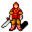

# { .sprite } Tonis

<div class="infobox" markdown>

<p class="ib-img">{ .sprite }</p>

| | |
|---|---|
| **Monster ID** | `tonis` |
| **Type** | NPC |
| **Class** | Humanoid |
| **HP** | 1 |
| **Found in** | Prim |
| **Introduced** | v0.7.0 or earlier |

</div>

## Combat stats

| Stat | Value |
|---|---|
| HP | 1 |
| Damage | 0 |
| Attack chance | 0 |
| Block chance | 0 |
| Damage resistance | 0 |
| Max AP | 10 |
| Attack cost | 10 AP |
| Attacks per turn | 1 |
| Move cost | 10 AP |
| Critical skill | 0 |
| Critical multiplier | – |
| Crit chance | none (needs critical skill and a multiplier) |

**XP formula** (from the game's loader): ⌈(attacks per turn × attack chance × average damage × (1 + critical skill × multiplier) × 3 + HP × (1 + block chance) + 9 × damage resistance) × 0.7⌉, +50 if its hits inflict a condition. More Exp adds a percentage on top.

<p class="verified">Verified against v0.8.18 monster data and game code (`MonsterTypeParser.java`).</p>


## Locations

| Map | Region | Up to | Notes |
|---|---|---|---|
| [blackwater_mountain10](../maps/blackwater_mountain10.md) | Prim | 1 | – |


## Quests

- [Clouded intent](../quests/prim_hunt.md): stages 10, 11

## Dialogue simulator

Set up your situation (quest stages, items, kills…), then talk to Tonis. The simulator follows the game's own rules: it takes the same silent checks, offers only the options you'd really see, and applies their effects (quest stages, items handed over, rewards) as you go.

<div class="dlg-sim" data-src="../../assets/dialogue/tonis_start.json" data-npc="Tonis" markdown="0"><noscript>The simulator needs JavaScript. The full dialogue is listed below.</noscript></div>

<p class="verified">Rules verified against v0.8.18 game code (ConversationController.java) and dialogue data.</p>

??? quote "Dialogue (12 lines)"

    *What the dialogue says, exactly as in the game files. Lines are listed once; links jump to the line a choice leads to.*

    <span id="d-tonis_start"></span>**`tonis_start`** *(silent check: the first matching branch below is taken)*

    - branch 1 *(if reached stage 10 of [Clouded intent](../quests/prim_hunt.md#stage-10))* → [tonis_return_1](#d-tonis_return_1)
    - branch 2 → [tonis_1](#d-tonis_1)

    <span id="d-tonis_return_1"></span>**`tonis_return_1`** Tonis: “Hello again. Have you spoken to Guthbered in the Prim main hall yet?”

    - “No, not yet. Where can I find him?” → [tonis_return_2](#d-tonis_return_2)
    - “Yes, he told me the story about Prim.” *(if reached stage 20 of [Clouded intent](../quests/prim_hunt.md#stage-20))* → [tonis_8](#d-tonis_8)
    - “No, and I do not intend to speak to him either. I am on an urgent mission to help the Blackwater mountain settlement.” → [tonis_return_3](#d-tonis_return_3)

    <span id="d-tonis_1"></span>**`tonis_1`** Tonis: “You there! Please you have to help us!”

    - “What is the matter?” → [tonis_6](#d-tonis_6)
    - “Is this the Blackwater mountain settlement?” → [tonis_2](#d-tonis_2)
    - “Sorry, I cannot be bothered right now. I was told to go east quickly.” → [tonis_4](#d-tonis_4)

    <span id="d-tonis_return_2"></span>**`tonis_return_2`** Tonis: “The village of Prim is just north of here. You can probably see it through the trees over there.”

    - “OK, I will go there right away.” → [tonis_8](#d-tonis_8)

    <span id="d-tonis_8"></span>**`tonis_8`** Tonis: “Good, thanks. We really need your help!” — **effects:** sets stage 11 of [Clouded intent](../quests/prim_hunt.md#stage-11)


    <span id="d-tonis_return_3"></span>**`tonis_return_3`** Tonis: “Do not listen to their lies!”


    <span id="d-tonis_6"></span>**`tonis_6`** Tonis: “We desperately need help from someone from the outside in our village of Prim.” — **effects:** sets stage 10 of [Clouded intent](../quests/prim_hunt.md#stage-10)

    - Next → [tonis_7](#d-tonis_7)

    <span id="d-tonis_2"></span>**`tonis_2`** Tonis: “Blackwater? No no, certainly not. Just over there is the village of Prim.”

    - Next → [tonis_3](#d-tonis_3)

    <span id="d-tonis_4"></span>**`tonis_4`** Tonis: “East? But that leads up to Blackwater mountain.”

    - Next → [tonis_5](#d-tonis_5)

    <span id="d-tonis_7"></span>**`tonis_7`** Tonis: “You should speak to Guthbered, in the Prim main hall, just north of here.”

    - “OK, I will go see him.” → [tonis_8](#d-tonis_8)
    - “I was told to go directly east.” → [tonis_4](#d-tonis_4)

    <span id="d-tonis_3"></span>**`tonis_3`** Tonis: “Blackwater mountain, those vicious bastards.”

    - Next → [tonis_6](#d-tonis_6)

    <span id="d-tonis_5"></span>**`tonis_5`** Tonis: “You really do not want to go up there.”

    - Next → [tonis_3](#d-tonis_3)


## Version history

| Version | Change |
|---|---|
| [v0.7.0](../versions/0.7.0.md) | Present in v0.7.0 (earliest release tracked) |
| [v0.7.2](../versions/0.7.2.md) | Dialogue: 4 lines changed |

<p class="verified">Verified against v0.8.18 and every earlier release back to v0.7.0 (game data compared release by release).</p>


## Community notes

<small>Written by players, not generated from game data. **Observations**: what players notice in-game · **Lore**: the in-world story · **Trivia**: real-world facts, references, development history · **Theory / speculation**: unconfirmed ideas; may just be unfinished content</small>

### Observations

*Nothing here yet. Know something? [Add it](https://github.com/asdfghjkl628/Andor-s-Trail-Wikiiii/new/main/notes/monsters?filename=tonis.md&value=%23%23%20Observations%0A%0A%3C%21--%20what%20players%20notice%20in-game%20--%3E%0A%0A%23%23%20Lore%0A%0A%3C%21--%20the%20in-world%20story%20--%3E%0A%0A%23%23%20Trivia%0A%0A%3C%21--%20real-world%20facts%2C%20references%2C%20development%20history%20--%3E%0A%0A%23%23%20Theory%20/%20speculation%0A%0A%3C%21--%20unconfirmed%20ideas%3B%20may%20just%20be%20unfinished%20content%20--%3E%0A).*

### Lore

*Nothing here yet. Know something? [Add it](https://github.com/asdfghjkl628/Andor-s-Trail-Wikiiii/new/main/notes/monsters?filename=tonis.md&value=%23%23%20Observations%0A%0A%3C%21--%20what%20players%20notice%20in-game%20--%3E%0A%0A%23%23%20Lore%0A%0A%3C%21--%20the%20in-world%20story%20--%3E%0A%0A%23%23%20Trivia%0A%0A%3C%21--%20real-world%20facts%2C%20references%2C%20development%20history%20--%3E%0A%0A%23%23%20Theory%20/%20speculation%0A%0A%3C%21--%20unconfirmed%20ideas%3B%20may%20just%20be%20unfinished%20content%20--%3E%0A).*

### Trivia

*Nothing here yet. Know something? [Add it](https://github.com/asdfghjkl628/Andor-s-Trail-Wikiiii/new/main/notes/monsters?filename=tonis.md&value=%23%23%20Observations%0A%0A%3C%21--%20what%20players%20notice%20in-game%20--%3E%0A%0A%23%23%20Lore%0A%0A%3C%21--%20the%20in-world%20story%20--%3E%0A%0A%23%23%20Trivia%0A%0A%3C%21--%20real-world%20facts%2C%20references%2C%20development%20history%20--%3E%0A%0A%23%23%20Theory%20/%20speculation%0A%0A%3C%21--%20unconfirmed%20ideas%3B%20may%20just%20be%20unfinished%20content%20--%3E%0A).*

### Theory / speculation

*Nothing here yet. Know something? [Add it](https://github.com/asdfghjkl628/Andor-s-Trail-Wikiiii/new/main/notes/monsters?filename=tonis.md&value=%23%23%20Observations%0A%0A%3C%21--%20what%20players%20notice%20in-game%20--%3E%0A%0A%23%23%20Lore%0A%0A%3C%21--%20the%20in-world%20story%20--%3E%0A%0A%23%23%20Trivia%0A%0A%3C%21--%20real-world%20facts%2C%20references%2C%20development%20history%20--%3E%0A%0A%23%23%20Theory%20/%20speculation%0A%0A%3C%21--%20unconfirmed%20ideas%3B%20may%20just%20be%20unfinished%20content%20--%3E%0A).*


??? info "Technical information"

    | | |
    |---|---|
    | Monster ID | `tonis` |
    | Spawn group | `tonis` |
    | Loot table | – |
    | Conversation | `tonis_start` |
    | Faction | – |
    | Movement | – |
    | Icon | `monsters_rltiles1:67` |
    | Defined in | `res/raw/monsterlist_v069_npcs.json` |

    Raw data:

    ```json
    {
     "id": "tonis",
     "name": "Tonis",
     "iconID": "monsters_rltiles1:67",
     "monsterClass": "humanoid",
     "spawnGroup": "tonis",
     "phraseID": "tonis_start"
    }
    ```


<small>Data from v0.8.18</small>
