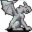

# { .sprite } Tough shadow gargoyle

| Stat | Value |
|---|---|
| Class | construct |
| HP | 37 |
| Max AP | 10 |
| Attack cost | 5 |
| Move cost | 10 |
| Damage | 4 to 10 |
| Attack chance | 70 |
| Block chance | 85 |
| Damage resistance | 4 |
| Critical skill | 8 |
| Critical multiplier | 3.0 |

!!! note "Immune to critical hits"
    Monsters of this class cannot be critically hit.

## Drops

| Item | Chance | Qty |
|---|---|---|
| [Gold coins](../items/gold.md) | 70% | 3 to 19 |
| [Ruby gem](../items/gem2.md) | 25% | 1 |
| [Regular potion of health](../items/health.md) | 25% | 1 |
| [Small rock](../items/rock.md) | 25% | 1 |

## Found on

- [gargoylecave1](../maps/gargoylecave1.md)
- [gargoylecave2](../maps/gargoylecave2.md)

<small>Monster ID: `tough_shadow_gargoyle` · Data from v0.8.18</small>
