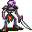

# { .sprite } Luthor's skeleton guard

| Stat | Value |
|---|---|
| Class | construct |
| HP | 52 |
| Max AP | 10 |
| Attack cost | 5 |
| Move cost | 10 |
| Damage | 1 to 3 |
| Attack chance | 60 |
| Block chance | 40 |
| Damage resistance | 1 |
| Critical skill | 0 |
| Critical multiplier | 0 |

!!! note "Immune to critical hits"
    Monsters of this class cannot be critically hit.

## Drops

| Item | Chance | Qty |
|---|---|---|
| [Gold coins](../items/gold.md) | 70% | 16 to 23 |
| [Ruby gem](../items/gem2.md) | 25% | 1 |
| [Regular potion of health](../items/health.md) | 25% | 1 |
| [Bone](../items/bone.md) | 30% | 1 |

## Found on

- [crackshot_hideout4](../maps/crackshot_hideout4.md)

<small>Monster ID: `tt_monster2` · Data from v0.8.18</small>
