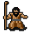

# { .sprite } Two-teeth

**Where to find Two-teeth:** Fallhaven: [woodhouse1](../maps/woodhouse1.md#pin-npc-twoteeth)

<div class="infobox" markdown>

<p class="ib-img">{ .sprite }</p>

| | |
|---|---|
| **Type** | NPC (can be spoken to; cannot be attacked) |
| **Role** | Starts [Sweet sweet rat poison](../quests/lowyna.md) |
| **Found in** | Fallhaven |
| **Entry ID** | `twoteeth` |
| **Introduced** | v0.7.0 or earlier |

</div>

## Quests

- [Sweet sweet rat poison](../quests/lowyna.md): stages 10, 40

## Dialogue simulator

Set the quest stages, items and other conditions that apply to your game, then start the conversation with Two-teeth. The simulator applies the game's own rules: it performs the same silent checks, offers only the options that would be shown in the game, and applies their effects (quest stages, items handed over, rewards) as the conversation proceeds.

<div class="dlg-sim" data-src="../../assets/dialogue/twoteeth.json" data-npc="Two-teeth" markdown="0"><noscript>The simulator needs JavaScript. The full dialogue is listed below.</noscript></div>

<p class="verified">Rules verified against v0.8.18 game code (ConversationController.java) and dialogue data.</p>

??? quote "Dialogue (22 lines)"

    *What the dialogue says, exactly as in the game files. Lines are listed once; links jump to the line a choice leads to.*

    <span id="d-twoteeth"></span>**`twoteeth`** *(silent check: the first matching branch below is taken)*

    - branch 1 *(if reached stage 40 of [Sweet sweet rat poison](../quests/lowyna.md#stage-40))* → [twoteeth_c1](#d-twoteeth_c1)
    - branch 2 *(if reached stage 10 of [Sweet sweet rat poison](../quests/lowyna.md#stage-10))* → [twoteeth_r1](#d-twoteeth_r1)
    - branch 3 → [twoteeth_1](#d-twoteeth_1)

    <span id="d-twoteeth_c1"></span>**`twoteeth_c1`** Two-teeth: “Hey, my little helper. Got any more of that rat poison for me?”

    - “I don't think it's such a good idea to help you. I could get in trouble.” → [twoteeth_10](#d-twoteeth_10)
    - “Go get it yourself.” → [twoteeth_c2](#d-twoteeth_c2)
    - “Here, have some.” *(if hand over 1× [Lowyna's rat poison](../items/drink_lowyn3.md))* → [twoteeth_c3](#d-twoteeth_c3)

    <span id="d-twoteeth_r1"></span>**`twoteeth_r1`** Two-teeth: “[Coughs heavily]”

    - Next → [twoteeth_r2](#d-twoteeth_r2)

    <span id="d-twoteeth_1"></span>**`twoteeth_1`** Two-teeth: “Hey kid. Yeah, you!”

    - Next → [twoteeth_2](#d-twoteeth_2)

    <span id="d-twoteeth_10"></span>**`twoteeth_10`** Two-teeth: “He he. Yes. Yes you could. But that's the beauty of it all!”

    - Next → [twoteeth_cough](#d-twoteeth_cough)

    <span id="d-twoteeth_c2"></span>**`twoteeth_c2`** Two-teeth: “I'm fine right here. *chuckle*”


    <span id="d-twoteeth_c3"></span>**`twoteeth_c3`** Two-teeth: “Har har. Thank you. Give that here.” — **effects:** sets stage 40 of [Sweet sweet rat poison](../quests/lowyna.md#stage-40)

    - Next → [twoteeth_c4](#d-twoteeth_c4)

    <span id="d-twoteeth_r2"></span>**`twoteeth_r2`** Two-teeth: “Hey, did you get that rat poison from Lowyna for me?”

    - “Where can I find her?” → [twoteeth_9](#d-twoteeth_9)
    - “Here, I got you some from Lowyna.” *(if hand over 1× [Lowyna's rat poison](../items/drink_lowyn3.md))* → [twoteeth_c3](#d-twoteeth_c3)

    <span id="d-twoteeth_2"></span>**`twoteeth_2`** Two-teeth: “He he. You might be of use. You'd help an old fella, wouldn't you?”

    - “Yikes! What is that smell?” → [twoteeth_3](#d-twoteeth_3)
    - “Yuck! What happened to your clothes, they're all dirty and torn up!” → [twoteeth_3](#d-twoteeth_3)
    - “Hey, what happened to your teeth? Did you lose them all, or did that bad breath of yours make them corrode?” → [twoteeth_3](#d-twoteeth_3)
    - “Did I just see something move inside that nasty beard of yours?” → [twoteeth_3](#d-twoteeth_3)

    <span id="d-twoteeth_cough"></span>**`twoteeth_cough`** Two-teeth: “[Coughs heavily]”


    <span id="d-twoteeth_c4"></span>**`twoteeth_c4`** Two-teeth: “Ah, that sweet sweet rat poison.”

    - “Hey, how about a reward?” → [twoteeth_c5](#d-twoteeth_c5)
    - “You're welcome.” → *conversation ends*

    <span id="d-twoteeth_9"></span>**`twoteeth_9`** Two-teeth: “She's in the other hut over there [points].”

    - “I don't think it's such a good idea to help you. I could get in trouble.” → [twoteeth_10](#d-twoteeth_10)
    - “I'll go get some rat poison for you.” → [twoteeth_11](#d-twoteeth_11)

    <span id="d-twoteeth_3"></span>**`twoteeth_3`** Two-teeth: “[Coughs heavily]”

    - Next → [twoteeth_4](#d-twoteeth_4)

    <span id="d-twoteeth_c5"></span>**`twoteeth_c5`** Two-teeth: “What? No, we didn't agree on anything like that.”

    - Next → [twoteeth_cough](#d-twoteeth_cough)

    <span id="d-twoteeth_11"></span>**`twoteeth_11`** Two-teeth: “Good. Tell her two-teeth sent you.” — **effects:** sets stage 10 of [Sweet sweet rat poison](../quests/lowyna.md#stage-10)


    <span id="d-twoteeth_4"></span>**`twoteeth_4`** Two-teeth: “Har har. That's nothing! You should have seen Lentural that was here before. Come here and let me have a look at you.”

    - “Yuck, get away from me!” → [twoteeth_5](#d-twoteeth_5)
    - “Stay away, or you'll not live to see the rest of the day!” → [twoteeth_5](#d-twoteeth_5)
    - “What do you want?” → [twoteeth_7](#d-twoteeth_7)

    <span id="d-twoteeth_5"></span>**`twoteeth_5`** Two-teeth: “OK, OK! No need to get all violent.”

    - Next → [twoteeth_6](#d-twoteeth_6)

    <span id="d-twoteeth_7"></span>**`twoteeth_7`** Two-teeth: “You'd help an old fella, right? Why don't you run over to Lowyna there and get me another one her bottles of rat poison.”

    - Next → [twoteeth_8](#d-twoteeth_8)

    <span id="d-twoteeth_6"></span>**`twoteeth_6`** Two-teeth: “Stupid kids.”


    <span id="d-twoteeth_8"></span>**`twoteeth_8`** Two-teeth: “Ah, that sweet rat poison.”

    - “Rat poison? Are you sure that's safe?” → [twoteeth_12](#d-twoteeth_12)
    - “Where can I find her?” → [twoteeth_9](#d-twoteeth_9)

    <span id="d-twoteeth_12"></span>**`twoteeth_12`** Two-teeth: “Oh sure! It's perfectly safe. Har har.”

    - Next → [twoteeth_13](#d-twoteeth_13)

    <span id="d-twoteeth_13"></span>**`twoteeth_13`** Two-teeth: “[Coughs heavily]”

    - “Where can I find her?” → [twoteeth_9](#d-twoteeth_9)
    - “I don't think it's such a good idea to help you. I could get in trouble.” → [twoteeth_10](#d-twoteeth_10)


## Version history

| Version | Change |
|---|---|
| [v0.7.0](../versions/0.7.0.md) | Present in v0.7.0 (earliest release tracked) |
| [v0.7.2](../versions/0.7.2.md) | Dialogue: 7 lines changed<br>· text: “[coughs heavily]” → “[Coughs heavily]”<br>· text: “[coughs heavily]” → “[Coughs heavily]” |

<p class="verified">Verified against v0.8.18 and every earlier release back to v0.7.0 (game data compared release by release).</p>


??? info "Technical information"

    | | |
    |---|---|
    | Entry ID | `twoteeth` |
    | Spawn group | `twoteeth` |
    | Loot table | – |
    | Conversation | `twoteeth` |
    | Faction | – |
    | Movement | – |
    | Icon | `monsters_tometik7:40` |
    | Defined in | `res/raw/monsterlist_v070_npcs.json` |

    Raw data:

    ```json
    {
     "id": "twoteeth",
     "name": "Two-teeth",
     "iconID": "monsters_tometik7:40",
     "phraseID": "twoteeth"
    }
    ```


## Community notes

<small>Written by players, not generated from game data. **Observations**: what players notice in-game · **Lore**: the in-world story · **Trivia**: real-world facts, references, development history · **Theory / speculation**: unconfirmed ideas; may just be unfinished content</small>

### Observations

*No notes yet. Contributions are welcome: [add a note](https://github.com/asdfghjkl628/Andor-s-Trail-Wikiiii/new/main/notes/monsters?filename=twoteeth.md&value=%23%23%20Observations%0A%0A%3C%21--%20what%20players%20notice%20in-game%20--%3E%0A%0A%23%23%20Lore%0A%0A%3C%21--%20the%20in-world%20story%20--%3E%0A%0A%23%23%20Trivia%0A%0A%3C%21--%20real-world%20facts%2C%20references%2C%20development%20history%20--%3E%0A%0A%23%23%20Theory%20/%20speculation%0A%0A%3C%21--%20unconfirmed%20ideas%3B%20may%20just%20be%20unfinished%20content%20--%3E%0A).*

### Lore

*No notes yet. Contributions are welcome: [add a note](https://github.com/asdfghjkl628/Andor-s-Trail-Wikiiii/new/main/notes/monsters?filename=twoteeth.md&value=%23%23%20Observations%0A%0A%3C%21--%20what%20players%20notice%20in-game%20--%3E%0A%0A%23%23%20Lore%0A%0A%3C%21--%20the%20in-world%20story%20--%3E%0A%0A%23%23%20Trivia%0A%0A%3C%21--%20real-world%20facts%2C%20references%2C%20development%20history%20--%3E%0A%0A%23%23%20Theory%20/%20speculation%0A%0A%3C%21--%20unconfirmed%20ideas%3B%20may%20just%20be%20unfinished%20content%20--%3E%0A).*

### Trivia

*No notes yet. Contributions are welcome: [add a note](https://github.com/asdfghjkl628/Andor-s-Trail-Wikiiii/new/main/notes/monsters?filename=twoteeth.md&value=%23%23%20Observations%0A%0A%3C%21--%20what%20players%20notice%20in-game%20--%3E%0A%0A%23%23%20Lore%0A%0A%3C%21--%20the%20in-world%20story%20--%3E%0A%0A%23%23%20Trivia%0A%0A%3C%21--%20real-world%20facts%2C%20references%2C%20development%20history%20--%3E%0A%0A%23%23%20Theory%20/%20speculation%0A%0A%3C%21--%20unconfirmed%20ideas%3B%20may%20just%20be%20unfinished%20content%20--%3E%0A).*

### Theory / speculation

*No notes yet. Contributions are welcome: [add a note](https://github.com/asdfghjkl628/Andor-s-Trail-Wikiiii/new/main/notes/monsters?filename=twoteeth.md&value=%23%23%20Observations%0A%0A%3C%21--%20what%20players%20notice%20in-game%20--%3E%0A%0A%23%23%20Lore%0A%0A%3C%21--%20the%20in-world%20story%20--%3E%0A%0A%23%23%20Trivia%0A%0A%3C%21--%20real-world%20facts%2C%20references%2C%20development%20history%20--%3E%0A%0A%23%23%20Theory%20/%20speculation%0A%0A%3C%21--%20unconfirmed%20ideas%3B%20may%20just%20be%20unfinished%20content%20--%3E%0A).*


<small>Data from v0.8.18</small>
