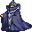

# { .sprite } Vacor

**Where to find Vacor:** Fallhaven: [fallhaven_sw](../maps/fallhaven_sw.md#pin-npc-vacor)

<div class="infobox" markdown>

<p class="ib-img">{ .sprite }</p>

| | |
|---|---|
| **Type** | NPC/Enemy (can be spoken to, but can also be fought) |
| **Role** | Starts [Missing pieces](../quests/vacor.md) |
| **Found in** | Fallhaven |
| **Class** | Humanoid |
| **HP** | 72 |
| **XP when defeated** | 111 |
| **Entry ID** | `vacor` |
| **Introduced** | v0.7.0 or earlier |

</div>

!!! warning "Can be fought"
    This entry can be talked to, but it can also become an opponent: a conversation with this character can end in combat (a dialogue branch leads to a fight).

## Combat statistics

| Statistic | Value |
|---|---|
| Class | Humanoid |
| HP | 72 |
| XP when defeated | 111 |
| Damage | 4 to 8 |
| Attack chance | 110 |
| Block chance | 40 |
| Damage resistance | 2 |
| Max AP | 10 |
| Attack cost | 5 AP |
| Attacks per turn | 2 |
| Move cost | 10 AP |
| Critical skill | 0 |
| Critical multiplier | – |
| Critical hit chance | None (requires both critical skill and a critical multiplier) |


<p class="verified">Verified against v0.8.18 monster data and game code (`MonsterTypeParser.java`).</p>

## Drops

| Item | Chance | Qty |
|---|---|---|
| [Gold coins](../items/gold.md) | 100% | 16 to 30 |
| [Regular potion of health](../items/health.md) | 100% | 1 |
| [Vacor's ring](../items/ring_vacor.md) | 100% | 1 |
| [Vacor's boots of attack](../items/boots_vacor.md) | 100% | 1 |

## Locations

| Map | Region | Up to | Notes |
|---|---|---|---|
| [fallhaven_sw](../maps/fallhaven_sw.md) | Fallhaven | 1 | – |

## Quests

- [Missing pieces](../quests/vacor.md): stages 10, 20, 30, 40, 54, 60
- [Old friends?](../quests/kaverin.md): stages 70, 75, 90

## Dialogue simulator

Set the quest stages, items and other conditions that apply to your game, then start the conversation with Vacor. The simulator applies the game's own rules: it performs the same silent checks, offers only the options that would be shown in the game, and applies their effects (quest stages, items handed over, rewards) as the conversation proceeds.

<div class="dlg-sim" data-src="../../assets/dialogue/vacor.json" data-npc="Vacor" markdown="0"><noscript>The simulator needs JavaScript. The full dialogue is listed below.</noscript></div>

<p class="verified">Rules verified against v0.8.18 game code (ConversationController.java) and dialogue data.</p>

??? quote "Dialogue (68 lines)"

    *What the dialogue says, exactly as in the game files. Lines are listed once; links jump to the line a choice leads to.*

    <span id="d-vacor"></span>**`vacor`** *(silent check: the first matching branch below is taken)*

    - branch 1 *(if reached stage 60 of [Missing pieces](../quests/vacor.md#stage-60))* → [vacor_return_complete0](#d-vacor_return_complete0)
    - branch 2 *(if reached stage 40 of [Missing pieces](../quests/vacor.md#stage-40))* → [vacor_return2](#d-vacor_return2)
    - branch 3 *(if reached stage 30 of [Missing pieces](../quests/vacor.md#stage-30))* → [vacor_42](#d-vacor_42)
    - branch 4 → [vacor_select1](#d-vacor_select1)

    <span id="d-vacor_return_complete0"></span>**`vacor_return_complete0`** *(silent check: the first matching branch below is taken)*

    - branch 1 *(if reached stage 90 of [Old friends?](../quests/kaverin.md#stage-90))* → [vacor_msg_16](#d-vacor_msg_16)
    - branch 2 *(if reached stage 75 of [Old friends?](../quests/kaverin.md#stage-75))* → [vacor_msg_9](#d-vacor_msg_9)
    - branch 3 *(if reached stage 60 of [Old friends?](../quests/kaverin.md#stage-60); carry 1× [Kaverin's sealed message](../items/kaverin_message.md))* → [vacor_msg1](#d-vacor_msg1)
    - branch 4 → [vacor_return_complete](#d-vacor_return_complete)

    <span id="d-vacor_return2"></span>**`vacor_return2`** Vacor: “Hello again. Any progress yet?”

    - “About Unzel...” → [vacor_return2_2](#d-vacor_return2_2)
    - “Could you tell me the story again?” → [vacor_43](#d-vacor_43)

    <span id="d-vacor_42"></span>**`vacor_42`** Vacor: “Now I should be able to finish the rift spell and open up the Shadow rift ... erm I mean open up new possibilities. Yes, that's what I meant.”

    - Next → [vacor_43](#d-vacor_43)

    <span id="d-vacor_select1"></span>**`vacor_select1`** *(silent check: the first matching branch below is taken)*

    - branch 1 *(if reached stage 20 of [Missing pieces](../quests/vacor.md#stage-20))* → [vacor_return1](#d-vacor_return1)
    - branch 2 → [vacor_begin](#d-vacor_begin)

    <span id="d-vacor_msg_16"></span>**`vacor_msg_16`** Vacor: “Thanks for giving me that message, but now please leave me. I have more important things to do than to talk to you.”


    <span id="d-vacor_msg_9"></span>**`vacor_msg_9`** Vacor: “It will lead you far to the southwest, to one of my secret retreats ... where a cache of potions is hidden.”

    - Next → [vacor_msg_10](#d-vacor_msg_10)

    <span id="d-vacor_msg1"></span>**`vacor_msg1`** Vacor: “What's that in your hands?! ... I recognize that seal!” — **effects:** sets stage 70 of [Old friends?](../quests/kaverin.md#stage-70)

    - “You should recognize it, I found this on one of Unzel's associates in Remgard.” → [vacor_msg_a1](#d-vacor_msg_a1)
    - “What? ... Oh, this?” → [vacor_msg_b1](#d-vacor_msg_b1)

    <span id="d-vacor_return_complete"></span>**`vacor_return_complete`** Vacor: “Hello again, my assassin friend. I will soon have my rift spell ready.”


    <span id="d-vacor_return2_2"></span>**`vacor_return2_2`** Vacor: “Have you killed Unzel for me yet? Bring me his signet ring when you have killed him.”

    - “I have dealt with him. Here is his ring.” *(if hand over 1× [Unzel's ring](../items/ring_unzel.md))* → [vacor_60](#d-vacor_60)
    - “I listened to Unzel's story and have decided to side with him. The Shadow must be preserved.” *(if reached stage 51 of [Missing pieces](../quests/vacor.md#stage-51))* → [vacor_70](#d-vacor_70)

    <span id="d-vacor_43"></span>**`vacor_43`** Vacor: “The only obstacle between me and continuing my rift spell research is that stupid Unzel fellow.”

    - Next → [vacor_44](#d-vacor_44)

    <span id="d-vacor_return1"></span>**`vacor_return1`** Vacor: “Hello again. How is the search for my missing pieces of the rift spell going?”

    - “I have found all the pieces.” *(if hand over 4× [Piece of Vacor's spell](../items/vacor_spell.md))* → [vacor_40](#d-vacor_40)
    - “What was I supposed to do again?” → [vacor_18](#d-vacor_18)
    - “Could you tell me the whole story again?” → [vacor_4](#d-vacor_4)

    <span id="d-vacor_begin"></span>**`vacor_begin`** Vacor: “Hello.”

    - Next → [vacor_2](#d-vacor_2)

    <span id="d-vacor_msg_10"></span>**`vacor_msg_10`** Vacor: “[The map shows a location to the northwest of the former prison of Flagstone]” — **effects:** sets stage 90 of [Old friends?](../quests/kaverin.md#stage-90)

    - Next → [vacor_msg_11](#d-vacor_msg_11)

    <span id="d-vacor_msg_a1"></span>**`vacor_msg_a1`** Vacor: “Surely, he didn't just give it to you!”

    - “He was asking too many questions. He needed to be silenced.” → [vacor_msg_a2](#d-vacor_msg_a2)

    <span id="d-vacor_msg_b1"></span>**`vacor_msg_b1`** Vacor: “How did you get your hands on that document?!”

    - “A man in Remgard, by the name of Kaverin, was asking about Unzel...” → [vacor_msg_b2](#d-vacor_msg_b2)

    <span id="d-vacor_60"></span>**`vacor_60`** Vacor: “Ha ha, Unzel is dead! That pathetic creature is gone!” — **effects:** sets stage 60 of [Missing pieces](../quests/vacor.md#stage-60)

    - Next → [vacor_61](#d-vacor_61)

    <span id="d-vacor_70"></span>**`vacor_70`** Vacor: “What? He told you his story? You actually believed it?”

    - Next → [vacor_71](#d-vacor_71)

    <span id="d-vacor_44"></span>**`vacor_44`** Vacor: “Unzel was my apprentice a while ago. But he started to annoy me with his questions and talk about morality.”

    - Next → [vacor_45](#d-vacor_45)

    <span id="d-vacor_40"></span>**`vacor_40`** Vacor: “Oh, you found all four pieces? Hurry, give them to me.” — **effects:** sets stage 30 of [Missing pieces](../quests/vacor.md#stage-30)

    - Next → [vacor_41](#d-vacor_41)

    <span id="d-vacor_18"></span>**`vacor_18`** Vacor: “OK, find the four pieces of my rift spell that the bandits took, and bring the pieces to me.” — **effects:** sets stage 20 of [Missing pieces](../quests/vacor.md#stage-20)

    - Next → [vacor_19](#d-vacor_19)

    <span id="d-vacor_4"></span>**`vacor_4`** Vacor: “A while ago, I was working on a rift spell that I had read about.”

    - Next → [vacor_5](#d-vacor_5)

    <span id="d-vacor_2"></span>**`vacor_2`** Vacor: “What are you, some kind of adventurer? Hmm. Maybe you can be of use to me.”

    - Next → [vacor_3](#d-vacor_3)

    <span id="d-vacor_msg_11"></span>**`vacor_msg_11`** Vacor: “Now, let's see here.”

    - Next → [vacor_msg_12](#d-vacor_msg_12)

    <span id="d-vacor_msg_a2"></span>**`vacor_msg_a2`** Vacor: “So, you killed him? Right?!”

    - “Kaverin is dead. His blood is still on my boots.” → [vacor_msg_3](#d-vacor_msg_3)

    <span id="d-vacor_msg_b2"></span>**`vacor_msg_b2`** Vacor: “What happened boy?!”

    - “Kaverin is dead. His blood is still on my boots.” → [vacor_msg_3](#d-vacor_msg_3)

    <span id="d-vacor_61"></span>**`vacor_61`** Vacor: “I can see the blood on your boots. I even got you to kill his minions beforehand.”

    - Next → [vacor_62](#d-vacor_62)

    <span id="d-vacor_71"></span>**`vacor_71`** Vacor: “I will give you one more chance. Either kill Unzel for me, and I will reward you handsomely, or you will have to fight me.”

    - “No. You must be stopped.” → [vacor_72](#d-vacor_72)
    - “OK, I'll think about it once more.” → *conversation ends*

    <span id="d-vacor_45"></span>**`vacor_45`** Vacor: “He said that my spell making was disrupting the will of the Shadow.”

    - Next → [vacor_46](#d-vacor_46)

    <span id="d-vacor_41"></span>**`vacor_41`** Vacor: “Yes, these are the pieces that the bandits took.”

    - Next → [vacor_42](#d-vacor_42)

    <span id="d-vacor_19"></span>**`vacor_19`** Vacor: “There were four bandits, and they all headed south of Fallhaven after I was attacked.”

    - Next → [vacor_20](#d-vacor_20)

    <span id="d-vacor_5"></span>**`vacor_5`** Vacor: “The spell is supposed to, shall we say, open up new possibilities.”

    - Next → [vacor_6](#d-vacor_6)

    <span id="d-vacor_3"></span>**`vacor_3`** Vacor: “Are you willing to help me?”

    - “Sure, what do you need help with?” → [vacor_4](#d-vacor_4)
    - “No, why should I help you?” → [vacor_bah](#d-vacor_bah)

    <span id="d-vacor_msg_12"></span>**`vacor_msg_12`** Vacor: “[Vacor opens the sealed message and starts reading]”

    - Next → [vacor_msg_13](#d-vacor_msg_13)

    <span id="d-vacor_msg_3"></span>**`vacor_msg_3`** Vacor: “Good, maybe now I can work on my Rift Spell in peace...”

    - Next → [vacor_msg_4](#d-vacor_msg_4)

    <span id="d-vacor_62"></span>**`vacor_62`** Vacor: “This is a great day indeed. I will soon have the power!”

    - Next → [vacor_63](#d-vacor_63)

    <span id="d-vacor_72"></span>**`vacor_72`** Vacor: “Bah, lowly creature. I knew I shouldn't have trusted you. Now you will die along with your precious Shadow.” — **effects:** sets stage 54 of [Missing pieces](../quests/vacor.md#stage-54)

    - “For the Shadow!” → *fight starts*
    - “You must be stopped.” → *fight starts*

    <span id="d-vacor_46"></span>**`vacor_46`** Vacor: “Bah, the Shadow. What has it ever done for ME?!”

    - Next → [vacor_47](#d-vacor_47)

    <span id="d-vacor_20"></span>**`vacor_20`** Vacor: “You should search the southern parts of Fallhaven for the four bandits.”

    - Next → [vacor_21](#d-vacor_21)

    <span id="d-vacor_6"></span>**`vacor_6`** Vacor: “Erm, yes, the rift spell will open things up alright. Ahem.”

    - Next → [vacor_7](#d-vacor_7)

    <span id="d-vacor_bah"></span>**`vacor_bah`** Vacor: “Bah, lowly creature. I knew I shouldn't have asked you. Now leave me.”


    <span id="d-vacor_msg_13"></span>**`vacor_msg_13`** Vacor: “Yes ... hmm ... really?! *mumbles* ...yes, indeed...”

    - Next → [vacor_msg_14](#d-vacor_msg_14)

    <span id="d-vacor_msg_4"></span>**`vacor_msg_4`** Vacor: “I must have that document!”

    - Next → [vacor_msg_5](#d-vacor_msg_5)

    <span id="d-vacor_63"></span>**`vacor_63`** Vacor: “Here, have these coins for your help.” — **effects:** gives [Gold coins](../items/gold.md)

    - Next → [vacor_64](#d-vacor_64)

    <span id="d-vacor_47"></span>**`vacor_47`** Vacor: “I shall one day cast my rift spell and we will be rid of the Shadow.”

    - Next → [vacor_48](#d-vacor_48)

    <span id="d-vacor_21"></span>**`vacor_21`** Vacor: “Please hurry! I am so eager to open up the rift ... erm, I mean finish the spell. Nothing odd with that right?”


    <span id="d-vacor_7"></span>**`vacor_7`** Vacor: “So there I was working hard on getting the last pieces together for it.”

    - Next → [vacor_8](#d-vacor_8)

    <span id="d-vacor_msg_14"></span>**`vacor_msg_14`** Vacor: “Thanks kid, you have helped me more than you can possibly understand.”

    - Next → [vacor_msg_15](#d-vacor_msg_15)

    <span id="d-vacor_msg_5"></span>**`vacor_msg_5`** Vacor: “I must know what they are planning!”

    - “Here, have the message.” *(if hand over 1× [Kaverin's sealed message](../items/kaverin_message.md))* → [vacor_msg_8](#d-vacor_msg_8)
    - “What's in it for me?” → [vacor_msg_6](#d-vacor_msg_6)

    <span id="d-vacor_64"></span>**`vacor_64`** Vacor: “Now leave me, I have work to do before I can cast the rift spell.”


    <span id="d-vacor_48"></span>**`vacor_48`** Vacor: “Anyway. I have a feeling that Unzel sent those bandits after me, and if I don't stop him he will probably send more.”

    - Next → [vacor_49](#d-vacor_49)

    <span id="d-vacor_8"></span>**`vacor_8`** Vacor: “Then, all of a sudden, a gang of thugs came around and started bullying me.”

    - Next → [vacor_9](#d-vacor_9)

    <span id="d-vacor_msg_15"></span>**`vacor_msg_15`** Vacor: “HA HA HA!!! THE POWER WILL SOON BE MINE!”

    - “Excellent! The Shadow must be stopped!” → [vacor_msg_16](#d-vacor_msg_16)
    - “I just wanted a reward... Weirdo.” → [vacor_msg_16](#d-vacor_msg_16)

    <span id="d-vacor_msg_8"></span>**`vacor_msg_8`** Vacor: “Here, take this map as compensation for your troubles.” — **effects:** gives [Map to Vacor's old hideout](../items/vacor_map.md), sets stage 75 of [Old friends?](../quests/kaverin.md#stage-75)

    - Next → [vacor_msg_9](#d-vacor_msg_9)

    <span id="d-vacor_msg_6"></span>**`vacor_msg_6`** Vacor: “I have a cache of potions hidden, far to the southwest.”

    - “Excellent, I could always use more supplies.” → [vacor_msg_7](#d-vacor_msg_7)

    <span id="d-vacor_49"></span>**`vacor_49`** Vacor: “I need you to find Unzel and kill him for me. He can probably be found somewhere southwest of Fallhaven.” — **effects:** sets stage 40 of [Missing pieces](../quests/vacor.md#stage-40)

    - Next → [vacor_50](#d-vacor_50)

    <span id="d-vacor_9"></span>**`vacor_9`** Vacor: “They said they were Messengers of the Shadow, and insisted that I should cease my spell making.”

    - Next → [vacor_10](#d-vacor_10)

    <span id="d-vacor_msg_7"></span>**`vacor_msg_7`** Vacor: “Good. Now give me the message.”

    - “Here is the message, Vacor.” *(if hand over 1× [Kaverin's sealed message](../items/kaverin_message.md))* → [vacor_msg_8](#d-vacor_msg_8)

    <span id="d-vacor_50"></span>**`vacor_50`** Vacor: “Bring me his signet ring as proof when you have killed him.”

    - Next → [vacor_51](#d-vacor_51)

    <span id="d-vacor_10"></span>**`vacor_10`** Vacor: “Preposterous, isn't it? I was so close to having the power!”

    - Next → [vacor_11](#d-vacor_11)

    <span id="d-vacor_51"></span>**`vacor_51`** Vacor: “Now hurry, I cannot wait much longer. The power shall be MINE!”


    <span id="d-vacor_11"></span>**`vacor_11`** Vacor: “Oh, the power I could have had. My dear rift spell.” — **effects:** sets stage 10 of [Missing pieces](../quests/vacor.md#stage-10)

    - Next → [vacor_12](#d-vacor_12)

    <span id="d-vacor_12"></span>**`vacor_12`** Vacor: “Anyway, I was just about to finish the last piece of my rift spell when the bandits came and robbed me.”

    - Next → [vacor_13](#d-vacor_13)

    <span id="d-vacor_13"></span>**`vacor_13`** Vacor: “The bandits took my notes for the spell and took off before I could call the guards.”

    - Next → [vacor_14](#d-vacor_14)

    <span id="d-vacor_14"></span>**`vacor_14`** Vacor: “After years of work, I can't seem to remember the last parts of the spell.”

    - Next → [vacor_15](#d-vacor_15)

    <span id="d-vacor_15"></span>**`vacor_15`** Vacor: “Do you think you could help me locate it? Then I could have the power at last!”

    - Next → [vacor_16](#d-vacor_16)

    <span id="d-vacor_16"></span>**`vacor_16`** Vacor: “You will of course be suitably rewarded for your part in me getting this power.”

    - “A reward? I'm in!” → [vacor_17](#d-vacor_17)
    - “Very well. I will help you.” → [vacor_17](#d-vacor_17)
    - “No thanks, this seems like something that I would rather not get involved with.” → [vacor_bah](#d-vacor_bah)

    <span id="d-vacor_17"></span>**`vacor_17`** Vacor: “I knew I couldn't trust... Wait, what? You actually said yes? Hah, well then.”

    - Next → [vacor_18](#d-vacor_18)


## Version history

| Version | Change |
|---|---|
| [v0.7.0](../versions/0.7.0.md) | Present in v0.7.0 (earliest release tracked) |
| [v0.7.2](../versions/0.7.2.md) | Dialogue: 14 lines changed<br>· text: “(Vacor opens the sealed message and starts reading)” → “[Vacor opens the sealed message and starts reading]”<br>· text: “Ok, find the four pieces of my rift spell that the bandits took, and …” → “OK, find the four pieces of my rift spell that the bandits took, and …” |

<p class="verified">Verified against v0.8.18 and every earlier release back to v0.7.0 (game data compared release by release).</p>


??? info "Technical information"

    | | |
    |---|---|
    | Entry ID | `vacor` |
    | Spawn group | `vacor` |
    | Loot table | `vacor` |
    | Conversation | `vacor` |
    | Faction | – |
    | Movement | – |
    | Icon | `monsters_mage:0` |
    | Defined in | `res/raw/monsterlist_fallhaven_npcs.json` |

    Raw data:

    ```json
    {
     "id": "vacor",
     "name": "Vacor",
     "iconID": "monsters_mage:0",
     "maxHP": 72,
     "unique": 1,
     "monsterClass": "humanoid",
     "attackDamage": {
      "min": 4,
      "max": 8
     },
     "spawnGroup": "vacor",
     "phraseID": "vacor",
     "droplistID": "vacor",
     "attackCost": 5,
     "attackChance": 110,
     "blockChance": 40,
     "damageResistance": 2
    }
    ```


??? info "How the XP value is calculated"

    The game computes each enemy's experience value when it loads the data (`MonsterTypeParser.java`):

    XP = ⌈(attacks per turn × attack chance × average damage × (1 + critical skill × critical multiplier) × 3 + HP × (1 + block chance) + 9 × damage resistance) × 0.7⌉

    Percentages are used as fractions (e.g. 60% = 0.6). Enemies whose attacks inflict a condition are worth 50 XP more. The More Exp skill adds a percentage on top.


## Community notes

<small>Written by players, not generated from game data. **Observations**: what players notice in-game · **Lore**: the in-world story · **Trivia**: real-world facts, references, development history · **Theory / speculation**: unconfirmed ideas; may just be unfinished content</small>

### Observations

*No notes yet. Contributions are welcome: [add a note](https://github.com/asdfghjkl628/Andor-s-Trail-Wikiiii/new/main/notes/monsters?filename=vacor.md&value=%23%23%20Observations%0A%0A%3C%21--%20what%20players%20notice%20in-game%20--%3E%0A%0A%23%23%20Lore%0A%0A%3C%21--%20the%20in-world%20story%20--%3E%0A%0A%23%23%20Trivia%0A%0A%3C%21--%20real-world%20facts%2C%20references%2C%20development%20history%20--%3E%0A%0A%23%23%20Theory%20/%20speculation%0A%0A%3C%21--%20unconfirmed%20ideas%3B%20may%20just%20be%20unfinished%20content%20--%3E%0A).*

### Lore

*No notes yet. Contributions are welcome: [add a note](https://github.com/asdfghjkl628/Andor-s-Trail-Wikiiii/new/main/notes/monsters?filename=vacor.md&value=%23%23%20Observations%0A%0A%3C%21--%20what%20players%20notice%20in-game%20--%3E%0A%0A%23%23%20Lore%0A%0A%3C%21--%20the%20in-world%20story%20--%3E%0A%0A%23%23%20Trivia%0A%0A%3C%21--%20real-world%20facts%2C%20references%2C%20development%20history%20--%3E%0A%0A%23%23%20Theory%20/%20speculation%0A%0A%3C%21--%20unconfirmed%20ideas%3B%20may%20just%20be%20unfinished%20content%20--%3E%0A).*

### Trivia

*No notes yet. Contributions are welcome: [add a note](https://github.com/asdfghjkl628/Andor-s-Trail-Wikiiii/new/main/notes/monsters?filename=vacor.md&value=%23%23%20Observations%0A%0A%3C%21--%20what%20players%20notice%20in-game%20--%3E%0A%0A%23%23%20Lore%0A%0A%3C%21--%20the%20in-world%20story%20--%3E%0A%0A%23%23%20Trivia%0A%0A%3C%21--%20real-world%20facts%2C%20references%2C%20development%20history%20--%3E%0A%0A%23%23%20Theory%20/%20speculation%0A%0A%3C%21--%20unconfirmed%20ideas%3B%20may%20just%20be%20unfinished%20content%20--%3E%0A).*

### Theory / speculation

*No notes yet. Contributions are welcome: [add a note](https://github.com/asdfghjkl628/Andor-s-Trail-Wikiiii/new/main/notes/monsters?filename=vacor.md&value=%23%23%20Observations%0A%0A%3C%21--%20what%20players%20notice%20in-game%20--%3E%0A%0A%23%23%20Lore%0A%0A%3C%21--%20the%20in-world%20story%20--%3E%0A%0A%23%23%20Trivia%0A%0A%3C%21--%20real-world%20facts%2C%20references%2C%20development%20history%20--%3E%0A%0A%23%23%20Theory%20/%20speculation%0A%0A%3C%21--%20unconfirmed%20ideas%3B%20may%20just%20be%20unfinished%20content%20--%3E%0A).*


<small>Data from v0.8.18</small>
