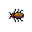

# { .sprite } Roach

| Stat | Value |
|---|---|
| Class | insect |
| HP | 0 |
| Max AP | 10 |
| Attack cost | 4 |
| Move cost | 10 |
| Damage | 0 to 1 |
| Attack chance | 10 |
| Block chance | 5 |
| Damage resistance | 0 |
| Critical skill | 0 |
| Critical multiplier | 0 |

## Drops

| Item | Chance | Qty |
|---|---|---|
| [Gold coins](../items/gold.md) | 20% | 0 to 1 |
| [Glass gem](../items/gem1.md) | 5% | 1 |

## Found on

- [gapfillerhole](../maps/gapfillerhole.md)
- [lodarhouse1](../maps/lodarhouse1.md)
- [woodhouse2](../maps/woodhouse2.md)
- [woodhouse3](../maps/woodhouse3.md)
- [woodsettlement0](../maps/woodsettlement0.md)

## Version history

| Version | Change |
|---|---|
| [v0.7.0](../versions/0.7.0.md) | Present in v0.7.0 (earliest release tracked) |
| [v0.7.2](../versions/0.7.2.md) | attackDamage: {"max": 1} → {"max": 1, "min": 0} |

Verified against v0.8.18 and every earlier release back to v0.7.0 (game data compared release by release).

<small>Monster ID: `vermin2` · Data from v0.8.18</small>
