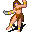

# { .sprite } Vilegard citizen

**Where to find Vilegard citizen:** Vilegard: [Vilegard north](../maps/vilegard_n.md#pin-npc-vilegard_citizen)

<div class="infobox" markdown>

<p class="ib-img"></p>

| | |
|---|---|
| **Type** | NPC (talk only; never fought) |
| **Found in** | Vilegard |
| **Introduced** | v0.7.0 or earlier |

</div>

## Dialogue simulator

Talk to Vilegard citizen as you would in the game. When the conversation depends on your progress (a quest, an item, a dice roll…), the simulator asks you. Try another answer with **Undo**.

<div class="dlg-sim" data-src="../../assets/dialogue/vilegard_villager_3.json" data-npc="Vilegard citizen" markdown="0"><noscript>The simulator needs JavaScript. The full dialogue is listed below.</noscript></div>

<p class="verified">Follows the game's own conversation rules (v0.8.18).</p>

??? quote "Dialogue (4 lines)"

    *Exactly as in the game files. Each line appears once; links jump to where a choice leads.*

    <span id="d-vilegard_villager_3"></span>**`vilegard_villager_3`** *(silent check: the first matching branch below is taken)*

    - branch 1 *(if reached stage 30 of [Trusting an outsider](../quests/vilegard.md#stage-30))* → [vilegard_villager_friend](#d-vilegard_villager_friend)
    - branch 2 → [vilegard_villager_3_0](#d-vilegard_villager_3_0)

    <span id="d-vilegard_villager_friend"></span>**`vilegard_villager_friend`** Vilegard citizen: “Hello there. I heard you helped us common folk here in Vilegard. Please stay for as long as you like friend.”

    - “Thank you. Have you seen my brother Andor around here?” → [vilegard_villager_friend_1](#d-vilegard_villager_friend_1)
    - “Thank you. See you.” → *conversation ends*

    <span id="d-vilegard_villager_3_0"></span>**`vilegard_villager_3_0`** Vilegard citizen: “This is Vilegard. You will find no comfort here, outsider.”


    <span id="d-vilegard_villager_friend_1"></span>**`vilegard_villager_friend_1`** Vilegard citizen: “Your brother? No, I haven't seen anyone that looks like you. But then again, I never take much notice to outsiders.”

    - “Thanks, bye.” → *conversation ends*


## Version history

| Version | Change |
|---|---|
| [v0.7.0](../versions/0.7.0.md) | Present in v0.7.0 (earliest release tracked) |
| [v0.7.2](../versions/0.7.2.md) | Dialogue: 1 line changed |

<p class="verified">Verified against v0.8.18 and every earlier release back to v0.7.0 (game data compared release by release).</p>


## Behind the scenes

*How the game data handles this character. Not needed for playing.*

??? info "Technical information"

    | | |
    |---|---|
    | Entry ID | `vilegard_citizen` |
    | Type (wiki) | NPC |
    | Spawn group | `vilegard_villager_3` |
    | Loot table | – |
    | Conversation | `vilegard_villager_3` |
    | Faction | – |
    | Movement | – |
    | Icon | `monsters_men:1` |
    | Defined in | `res/raw/monsterlist_v068_npcs.json` |

    Raw data:

    ```json
    {
     "id": "vilegard_citizen",
     "name": "Vilegard citizen",
     "iconID": "monsters_men:1",
     "monsterClass": "humanoid",
     "spawnGroup": "vilegard_villager_3",
     "phraseID": "vilegard_villager_3"
    }
    ```


## Community notes

<small>Written by players, not generated from game data. **Observations**: what players notice in-game · **Lore**: the in-world story · **Trivia**: real-world facts, references, development history · **Theory / speculation**: unconfirmed ideas; may just be unfinished content</small>

### Observations

*No notes yet. Contributions are welcome: [add a note](https://github.com/asdfghjkl628/Andor-s-Trail-Wikiiii/new/main/notes/monsters?filename=vilegard_citizen.md&value=%23%23%20Observations%0A%0A%3C%21--%20what%20players%20notice%20in-game%20--%3E%0A%0A%23%23%20Lore%0A%0A%3C%21--%20the%20in-world%20story%20--%3E%0A%0A%23%23%20Trivia%0A%0A%3C%21--%20real-world%20facts%2C%20references%2C%20development%20history%20--%3E%0A%0A%23%23%20Theory%20/%20speculation%0A%0A%3C%21--%20unconfirmed%20ideas%3B%20may%20just%20be%20unfinished%20content%20--%3E%0A).*

### Lore

*No notes yet. Contributions are welcome: [add a note](https://github.com/asdfghjkl628/Andor-s-Trail-Wikiiii/new/main/notes/monsters?filename=vilegard_citizen.md&value=%23%23%20Observations%0A%0A%3C%21--%20what%20players%20notice%20in-game%20--%3E%0A%0A%23%23%20Lore%0A%0A%3C%21--%20the%20in-world%20story%20--%3E%0A%0A%23%23%20Trivia%0A%0A%3C%21--%20real-world%20facts%2C%20references%2C%20development%20history%20--%3E%0A%0A%23%23%20Theory%20/%20speculation%0A%0A%3C%21--%20unconfirmed%20ideas%3B%20may%20just%20be%20unfinished%20content%20--%3E%0A).*

### Trivia

*No notes yet. Contributions are welcome: [add a note](https://github.com/asdfghjkl628/Andor-s-Trail-Wikiiii/new/main/notes/monsters?filename=vilegard_citizen.md&value=%23%23%20Observations%0A%0A%3C%21--%20what%20players%20notice%20in-game%20--%3E%0A%0A%23%23%20Lore%0A%0A%3C%21--%20the%20in-world%20story%20--%3E%0A%0A%23%23%20Trivia%0A%0A%3C%21--%20real-world%20facts%2C%20references%2C%20development%20history%20--%3E%0A%0A%23%23%20Theory%20/%20speculation%0A%0A%3C%21--%20unconfirmed%20ideas%3B%20may%20just%20be%20unfinished%20content%20--%3E%0A).*

### Theory / speculation

*No notes yet. Contributions are welcome: [add a note](https://github.com/asdfghjkl628/Andor-s-Trail-Wikiiii/new/main/notes/monsters?filename=vilegard_citizen.md&value=%23%23%20Observations%0A%0A%3C%21--%20what%20players%20notice%20in-game%20--%3E%0A%0A%23%23%20Lore%0A%0A%3C%21--%20the%20in-world%20story%20--%3E%0A%0A%23%23%20Trivia%0A%0A%3C%21--%20real-world%20facts%2C%20references%2C%20development%20history%20--%3E%0A%0A%23%23%20Theory%20/%20speculation%0A%0A%3C%21--%20unconfirmed%20ideas%3B%20may%20just%20be%20unfinished%20content%20--%3E%0A).*


<small>Data from v0.8.18</small>
