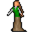

# { .sprite } Godelieve

<div class="infobox" markdown>

<p class="ib-img">{ .sprite }</p>

| | |
|---|---|
| **Type** | NPC/Enemy (can be spoken to, but can also be fought) |
| **Found in** | Wexlow Village, gamjee_well_jail_cells |
| **Class** | Humanoid |
| **HP** | 1 |
| **XP when defeated** | 1 |
| **Entries in game data** | 3 |
| **Introduced** | [v0.8.12.1](../versions/0.8.12.1.md) |

</div>

!!! info "3 entries in the game data"
    The game's data files define 3 separate characters named Godelieve. Andor's Trail stores a character as a new entry whenever it needs different behaviour, for example a different conversation at a later stage of a quest, a different location, or different combat statistics. Some entries represent the same person at different points in the story; others are different people who share a generic name. Here the entries differ in: conversation, location. This page combines them; each entry is described in its own section below.

| Entry | Type | Location | Role | HP |
|---|---|---|---|---|
| [`village_godelieve`](#v-village_godelieve) | NPC | Wexlow Village: [wexlow_village_nw_house](../maps/wexlow_village_nw_house.md#pin-npc-village_godelieve) | – | – |
| [`troll_hollow_godelieve`](#v-troll_hollow_godelieve) | Enemy | [gamjee_well_jail_cells](../maps/gamjee_well_jail_cells.md) | – | 1 |
| [`village_godelieve_hidden`](#v-village_godelieve_hidden) | Enemy | Wexlow Village: [wexlow_village](../maps/wexlow_village.md) | – | 1 |

## Wexlow Village, Wexlow village north-west house (village_godelieve) { #v-village_godelieve }

**Entry ID:** `village_godelieve` · **Type:** NPC

**Location:** Wexlow Village: [wexlow_village_nw_house](../maps/wexlow_village_nw_house.md#pin-npc-village_godelieve)

### Quests

- [Echoes of enchantment](../quests/echoes_of_enchantment.md): stage 14
- [feygard_nondisplayed (hidden flag)](../quests/feygard_nondisplayed.md): stage 9

### Dialogue simulator

Set the quest stages, items and other conditions that apply to your game, then start the conversation with Godelieve. The simulator applies the game's own rules: it performs the same silent checks, offers only the options that would be shown in the game, and applies their effects (quest stages, items handed over, rewards) as the conversation proceeds.

<div class="dlg-sim" data-src="../../assets/dialogue/village_godelieve_selector.json" data-npc="Godelieve" markdown="0"><noscript>The simulator needs JavaScript. The full dialogue is listed below.</noscript></div>

<p class="verified">Rules verified against v0.8.18 game code (ConversationController.java) and dialogue data.</p>

??? quote "Dialogue (5 lines)"

    *What the dialogue says, exactly as in the game files. Lines are listed once; links jump to the line a choice leads to.*

    <span id="d-village_godelieve-village_godelieve_selector"></span>**`village_godelieve_selector`** *(silent check: the first matching branch below is taken)*

    - Next *(if NOT reached stage 14 of [Echoes of enchantment](../quests/echoes_of_enchantment.md#stage-14))* → [village_godelieve_1](#d-village_godelieve-village_godelieve_1)
    - Next → [village_godelieve_generic](#d-village_godelieve-village_godelieve_generic)

    <span id="d-village_godelieve-village_godelieve_1"></span>**`village_godelieve_1`** Godelieve: “Oh, our hero returns to us.”

    - “I'm just happy to see you guys safe.” → [village_godelieve_2](#d-village_godelieve-village_godelieve_2)

    <span id="d-village_godelieve-village_godelieve_generic"></span>**`village_godelieve_generic`** Godelieve: “It's very nice to see you again.”

    - “Would it be OK with you if I slept here? I'm pretty tired.” *(if reached stage 12 of [Echoes of enchantment](../quests/echoes_of_enchantment.md#stage-12))* → [village_godelieve_bed](#d-village_godelieve-village_godelieve_bed)

    <span id="d-village_godelieve-village_godelieve_2"></span>**`village_godelieve_2`** Godelieve: “I'm just happy to curl up with Godwin in our own bed tonight.” — **effects:** sets stage 14 of [Echoes of enchantment](../quests/echoes_of_enchantment.md#stage-14)


    <span id="d-village_godelieve-village_godelieve_bed"></span>**`village_godelieve_bed`** Godelieve: “Of course. Just use the mat over there in the corner.” — **effects:** sets stage 9 of [feygard_nondisplayed (hidden flag)](../quests/feygard_nondisplayed.md#stage-9)


### Version history

| Version | Change |
|---|---|
| [v0.8.12.1](../versions/0.8.12.1.md) | Added<br>Dialogue: 5 lines added |

<p class="verified">Verified against v0.8.18 and every earlier release back to v0.7.0 (game data compared release by release).</p>


??? info "Technical information (village_godelieve)"

    | | |
    |---|---|
    | Entry ID | `village_godelieve` |
    | Spawn group | `village_godelieve` |
    | Loot table | – |
    | Conversation | `village_godelieve_selector` |
    | Faction | – |
    | Movement | none |
    | Icon | `monsters_ld1:144` |
    | Defined in | `res/raw/monsterlist_feygard_1.json` |

    Raw data:

    ```json
    {
     "id": "village_godelieve",
     "name": "Godelieve",
     "iconID": "monsters_ld1:144",
     "moveCost": 5,
     "unique": 1,
     "monsterClass": "humanoid",
     "movementAggressionType": "none",
     "phraseID": "village_godelieve_selector"
    }
    ```


## Gamjee well jail cells (troll_hollow_godelieve) { #v-troll_hollow_godelieve }

**Entry ID:** `troll_hollow_godelieve` · **Type:** Enemy

**Location:** [gamjee_well_jail_cells](../maps/gamjee_well_jail_cells.md)

### Combat statistics

| Statistic | Value |
|---|---|
| Class | Humanoid |
| HP | 1 |
| XP when defeated | 1 |
| Damage | 0 |
| Attack chance | 0 |
| Block chance | 0 |
| Damage resistance | 0 |
| Max AP | 10 |
| Attack cost | 10 AP |
| Attacks per turn | 1 |
| Move cost | 3 AP |
| Critical skill | 0 |
| Critical multiplier | – |
| Critical hit chance | None (requires both critical skill and a critical multiplier) |


<p class="verified">Verified against v0.8.18 monster data and game code (`MonsterTypeParser.java`).</p>

### Locations

| Map | Region | Up to | Notes |
|---|---|---|---|
| [gamjee_well_jail_cells](../maps/gamjee_well_jail_cells.md) | – | 1 | – |


### Version history

| Version | Change |
|---|---|
| [v0.8.12.1](../versions/0.8.12.1.md) | Added |

<p class="verified">Verified against v0.8.18 and every earlier release back to v0.7.0 (game data compared release by release).</p>


??? info "Technical information (troll_hollow_godelieve)"

    | | |
    |---|---|
    | Entry ID | `troll_hollow_godelieve` |
    | Spawn group | `troll_hollow_godelieve` |
    | Loot table | – |
    | Conversation | – |
    | Faction | – |
    | Movement | none |
    | Icon | `monsters_ld1:144` |
    | Defined in | `res/raw/monsterlist_feygard_1.json` |

    Raw data:

    ```json
    {
     "id": "troll_hollow_godelieve",
     "name": "Godelieve",
     "iconID": "monsters_ld1:144",
     "moveCost": 3,
     "unique": 1,
     "monsterClass": "humanoid",
     "movementAggressionType": "none"
    }
    ```


## Wexlow Village, Wexlow village (village_godelieve_hidden) { #v-village_godelieve_hidden }

**Entry ID:** `village_godelieve_hidden` · **Type:** Enemy

**Location:** Wexlow Village: [wexlow_village](../maps/wexlow_village.md)

### Combat statistics

| Statistic | Value |
|---|---|
| Class | Humanoid |
| HP | 1 |
| XP when defeated | 1 |
| Damage | 0 |
| Attack chance | 0 |
| Block chance | 0 |
| Damage resistance | 0 |
| Max AP | 10 |
| Attack cost | 10 AP |
| Attacks per turn | 1 |
| Move cost | 5 AP |
| Critical skill | 0 |
| Critical multiplier | – |
| Critical hit chance | None (requires both critical skill and a critical multiplier) |


<p class="verified">Verified against v0.8.18 monster data and game code (`MonsterTypeParser.java`).</p>

### Locations

| Map | Region | Up to | Notes |
|---|---|---|---|
| [wexlow_village](../maps/wexlow_village.md) | Wexlow Village | 1 | – |


### Version history

| Version | Change |
|---|---|
| [v0.8.12.1](../versions/0.8.12.1.md) | Added |

<p class="verified">Verified against v0.8.18 and every earlier release back to v0.7.0 (game data compared release by release).</p>


??? info "Technical information (village_godelieve_hidden)"

    | | |
    |---|---|
    | Entry ID | `village_godelieve_hidden` |
    | Spawn group | `village_godelieve_hidden` |
    | Loot table | – |
    | Conversation | – |
    | Faction | – |
    | Movement | none |
    | Icon | `monsters_ld1:144` |
    | Defined in | `res/raw/monsterlist_feygard_1.json` |

    Raw data:

    ```json
    {
     "id": "village_godelieve_hidden",
     "name": "Godelieve",
     "iconID": "monsters_ld1:144",
     "moveCost": 5,
     "monsterClass": "humanoid",
     "movementAggressionType": "none"
    }
    ```


??? info "How the XP value is calculated"

    The game computes each enemy's experience value when it loads the data (`MonsterTypeParser.java`):

    XP = ⌈(attacks per turn × attack chance × average damage × (1 + critical skill × critical multiplier) × 3 + HP × (1 + block chance) + 9 × damage resistance) × 0.7⌉

    Percentages are used as fractions (e.g. 60% = 0.6). Enemies whose attacks inflict a condition are worth 50 XP more. The More Exp skill adds a percentage on top.


## Community notes

<small>Written by players, not generated from game data. **Observations**: what players notice in-game · **Lore**: the in-world story · **Trivia**: real-world facts, references, development history · **Theory / speculation**: unconfirmed ideas; may just be unfinished content</small>

### Observations

*No notes yet. Contributions are welcome: [add a note](https://github.com/asdfghjkl628/Andor-s-Trail-Wikiiii/new/main/notes/monsters?filename=village_godelieve.md&value=%23%23%20Observations%0A%0A%3C%21--%20what%20players%20notice%20in-game%20--%3E%0A%0A%23%23%20Lore%0A%0A%3C%21--%20the%20in-world%20story%20--%3E%0A%0A%23%23%20Trivia%0A%0A%3C%21--%20real-world%20facts%2C%20references%2C%20development%20history%20--%3E%0A%0A%23%23%20Theory%20/%20speculation%0A%0A%3C%21--%20unconfirmed%20ideas%3B%20may%20just%20be%20unfinished%20content%20--%3E%0A).*

### Lore

*No notes yet. Contributions are welcome: [add a note](https://github.com/asdfghjkl628/Andor-s-Trail-Wikiiii/new/main/notes/monsters?filename=village_godelieve.md&value=%23%23%20Observations%0A%0A%3C%21--%20what%20players%20notice%20in-game%20--%3E%0A%0A%23%23%20Lore%0A%0A%3C%21--%20the%20in-world%20story%20--%3E%0A%0A%23%23%20Trivia%0A%0A%3C%21--%20real-world%20facts%2C%20references%2C%20development%20history%20--%3E%0A%0A%23%23%20Theory%20/%20speculation%0A%0A%3C%21--%20unconfirmed%20ideas%3B%20may%20just%20be%20unfinished%20content%20--%3E%0A).*

### Trivia

*No notes yet. Contributions are welcome: [add a note](https://github.com/asdfghjkl628/Andor-s-Trail-Wikiiii/new/main/notes/monsters?filename=village_godelieve.md&value=%23%23%20Observations%0A%0A%3C%21--%20what%20players%20notice%20in-game%20--%3E%0A%0A%23%23%20Lore%0A%0A%3C%21--%20the%20in-world%20story%20--%3E%0A%0A%23%23%20Trivia%0A%0A%3C%21--%20real-world%20facts%2C%20references%2C%20development%20history%20--%3E%0A%0A%23%23%20Theory%20/%20speculation%0A%0A%3C%21--%20unconfirmed%20ideas%3B%20may%20just%20be%20unfinished%20content%20--%3E%0A).*

### Theory / speculation

*No notes yet. Contributions are welcome: [add a note](https://github.com/asdfghjkl628/Andor-s-Trail-Wikiiii/new/main/notes/monsters?filename=village_godelieve.md&value=%23%23%20Observations%0A%0A%3C%21--%20what%20players%20notice%20in-game%20--%3E%0A%0A%23%23%20Lore%0A%0A%3C%21--%20the%20in-world%20story%20--%3E%0A%0A%23%23%20Trivia%0A%0A%3C%21--%20real-world%20facts%2C%20references%2C%20development%20history%20--%3E%0A%0A%23%23%20Theory%20/%20speculation%0A%0A%3C%21--%20unconfirmed%20ideas%3B%20may%20just%20be%20unfinished%20content%20--%3E%0A).*


<small>Data from v0.8.18</small>
