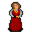

# { .sprite } Odilia

<div class="infobox" markdown>

<p class="ib-img">{ .sprite }</p>

| | |
|---|---|
| **Type** | NPC (can be spoken to; cannot be attacked) |
| **Found in** | Wexlow Village, Gamjee well jail cells |
| **Entries in game data** | 2 |
| **Introduced** | [v0.8.12.1](../versions/0.8.12.1.md) |

</div>

!!! info "2 entries in the game data"
    The game data defines 2 separate characters named Odilia. The game makes a new entry whenever a character needs different behaviour (another conversation later in a quest, another location, other stats). Some are the same person at different story points; others just share a generic name. Here the entries differ in: conversation, location, combat statistics, movement. Each entry has its own section below.

| Entry | Type | Location | Role |
|---|---|---|---|
| [`village_odilia`](#v-village_odilia) | NPC | Wexlow Village: [Wexlow village south-west house](../maps/wexlow_village_sw_house.md#pin-npc-village_odilia) | – |
| [`troll_hollow_odilia`](#v-troll_hollow_odilia) | Scenery | [Gamjee well jail cells](../maps/gamjee_well_jail_cells.md) | – |

## Wexlow Village, Wexlow village south-west house (village_odilia) { #v-village_odilia }

**Entry ID:** `village_odilia` · **Type:** NPC

**Location:** Wexlow Village: [Wexlow village south-west house](../maps/wexlow_village_sw_house.md#pin-npc-village_odilia)

### Dialogue simulator

Set your quest stages and items, then talk to Odilia. Same rules as the game: same checks, same options, same effects.

<div class="dlg-sim" data-src="../../assets/dialogue/village_odilia_start.json" data-npc="Odilia" markdown="0"><noscript>The simulator needs JavaScript. The full dialogue is listed below.</noscript></div>

<p class="verified">Rules verified against v0.8.18 game code (ConversationController.java) and dialogue data.</p>

??? quote "Dialogue (6 lines)"

    *Exactly as in the game files. Each line appears once; links jump to where a choice leads.*

    <span id="d-village_odilia-village_odilia_start"></span>**`village_odilia_start`** Odilia: “Thank you for rescuing us earlier!”

    - “How did the troll manage to capture all of you without anyone noticing?” → [wexlow_odilia_explain_capture](#d-village_odilia-wexlow_odilia_explain_capture)
    - “What about you? How are you doing?” → [village_odilia_cleanup](#d-village_odilia-village_odilia_cleanup)

    <span id="d-village_odilia-wexlow_odilia_explain_capture"></span>**`wexlow_odilia_explain_capture`** Odilia: “The well was enchanted. We felt a strange compulsion to visit it, especially when alone.”

    - “Enchanted, how?” → [wexlow_odilia_explain_capture_1](#d-village_odilia-wexlow_odilia_explain_capture_1)

    <span id="d-village_odilia-village_odilia_cleanup"></span>**`village_odilia_cleanup`** Odilia: “Everything's out of place, left exactly as it was when we... when we vanished. It's eerie, really. We'll need everyone's help to tidy up and get the village back to how it was. But first, we need to clear away the webs and rot.”


    <span id="d-village_odilia-wexlow_odilia_explain_capture_1"></span>**`wexlow_odilia_explain_capture_1`** Odilia: “The well has been enchanted by the troll. Anyone who draws water from it feels an inexplicable compulsion to keep returning.”

    - “And you were one to draw water from the well?” → [wexlow_odilia_explain_capture_2](#d-village_odilia-wexlow_odilia_explain_capture_2)

    <span id="d-village_odilia-wexlow_odilia_explain_capture_2"></span>**`wexlow_odilia_explain_capture_2`** Odilia: “Yes and every night, I would awake to find myself at the well with no memory of how I got there.”

    - “What?!” → [wexlow_odilia_explain_capture_3](#d-village_odilia-wexlow_odilia_explain_capture_3)

    <span id="d-village_odilia-wexlow_odilia_explain_capture_3"></span>**`wexlow_odilia_explain_capture_3`** Odilia: “Yes. This happened many times before that thing finally got me.”

    - “Well, you are safe now.” → *conversation ends*


### Version history

| Version | Change |
|---|---|
| [v0.8.12.1](../versions/0.8.12.1.md) | Added<br>Dialogue: 6 lines added |

<p class="verified">Verified against v0.8.18 and every earlier release back to v0.7.0 (game data compared release by release).</p>


??? info "Technical information (village_odilia)"

    | | |
    |---|---|
    | Entry ID | `village_odilia` |
    | Spawn group | `village_odilia` |
    | Loot table | – |
    | Conversation | `village_odilia_start` |
    | Faction | – |
    | Movement | none |
    | Icon | `monsters_ld1:189` |
    | Defined in | `res/raw/monsterlist_feygard_1.json` |

    Raw data:

    ```json
    {
     "id": "village_odilia",
     "name": "Odilia",
     "iconID": "monsters_ld1:189",
     "unique": 1,
     "monsterClass": "humanoid",
     "movementAggressionType": "none",
     "phraseID": "village_odilia_start"
    }
    ```


## Gamjee well jail cells (troll_hollow_odilia) { #v-troll_hollow_odilia }

**Entry ID:** `troll_hollow_odilia` · **Type:** Scenery

**Location:** [Gamjee well jail cells](../maps/gamjee_well_jail_cells.md)

!!! note "Scenery"
    No conversation and no combat statistics: a decoration, an animal or a figure in a scripted scene.


### Version history

| Version | Change |
|---|---|
| [v0.8.12.1](../versions/0.8.12.1.md) | Added |

<p class="verified">Verified against v0.8.18 and every earlier release back to v0.7.0 (game data compared release by release).</p>


??? info "Technical information (troll_hollow_odilia)"

    | | |
    |---|---|
    | Entry ID | `troll_hollow_odilia` |
    | Spawn group | `troll_hollow_odilia` |
    | Loot table | – |
    | Conversation | – |
    | Faction | – |
    | Movement | wholeMap |
    | Icon | `monsters_ld1:189` |
    | Defined in | `res/raw/monsterlist_feygard_1.json` |

    Raw data:

    ```json
    {
     "id": "troll_hollow_odilia",
     "name": "Odilia",
     "iconID": "monsters_ld1:189",
     "maxAP": 10,
     "moveCost": 5,
     "unique": 1,
     "monsterClass": "humanoid",
     "movementAggressionType": "wholeMap"
    }
    ```


## Community notes

<small>Written by players, not generated from game data. **Observations**: what players notice in-game · **Lore**: the in-world story · **Trivia**: real-world facts, references, development history · **Theory / speculation**: unconfirmed ideas; may just be unfinished content</small>

### Observations

*No notes yet. Contributions are welcome: [add a note](https://github.com/asdfghjkl628/Andor-s-Trail-Wikiiii/new/main/notes/monsters?filename=village_odilia.md&value=%23%23%20Observations%0A%0A%3C%21--%20what%20players%20notice%20in-game%20--%3E%0A%0A%23%23%20Lore%0A%0A%3C%21--%20the%20in-world%20story%20--%3E%0A%0A%23%23%20Trivia%0A%0A%3C%21--%20real-world%20facts%2C%20references%2C%20development%20history%20--%3E%0A%0A%23%23%20Theory%20/%20speculation%0A%0A%3C%21--%20unconfirmed%20ideas%3B%20may%20just%20be%20unfinished%20content%20--%3E%0A).*

### Lore

*No notes yet. Contributions are welcome: [add a note](https://github.com/asdfghjkl628/Andor-s-Trail-Wikiiii/new/main/notes/monsters?filename=village_odilia.md&value=%23%23%20Observations%0A%0A%3C%21--%20what%20players%20notice%20in-game%20--%3E%0A%0A%23%23%20Lore%0A%0A%3C%21--%20the%20in-world%20story%20--%3E%0A%0A%23%23%20Trivia%0A%0A%3C%21--%20real-world%20facts%2C%20references%2C%20development%20history%20--%3E%0A%0A%23%23%20Theory%20/%20speculation%0A%0A%3C%21--%20unconfirmed%20ideas%3B%20may%20just%20be%20unfinished%20content%20--%3E%0A).*

### Trivia

*No notes yet. Contributions are welcome: [add a note](https://github.com/asdfghjkl628/Andor-s-Trail-Wikiiii/new/main/notes/monsters?filename=village_odilia.md&value=%23%23%20Observations%0A%0A%3C%21--%20what%20players%20notice%20in-game%20--%3E%0A%0A%23%23%20Lore%0A%0A%3C%21--%20the%20in-world%20story%20--%3E%0A%0A%23%23%20Trivia%0A%0A%3C%21--%20real-world%20facts%2C%20references%2C%20development%20history%20--%3E%0A%0A%23%23%20Theory%20/%20speculation%0A%0A%3C%21--%20unconfirmed%20ideas%3B%20may%20just%20be%20unfinished%20content%20--%3E%0A).*

### Theory / speculation

*No notes yet. Contributions are welcome: [add a note](https://github.com/asdfghjkl628/Andor-s-Trail-Wikiiii/new/main/notes/monsters?filename=village_odilia.md&value=%23%23%20Observations%0A%0A%3C%21--%20what%20players%20notice%20in-game%20--%3E%0A%0A%23%23%20Lore%0A%0A%3C%21--%20the%20in-world%20story%20--%3E%0A%0A%23%23%20Trivia%0A%0A%3C%21--%20real-world%20facts%2C%20references%2C%20development%20history%20--%3E%0A%0A%23%23%20Theory%20/%20speculation%0A%0A%3C%21--%20unconfirmed%20ideas%3B%20may%20just%20be%20unfinished%20content%20--%3E%0A).*


<small>Data from v0.8.18</small>
