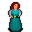

# { .sprite } Theodora

**Where to find Theodora:** [Wexlow Village, Wexlow village](#v-village_theodora), [Gamjee well jail cells](#v-troll_hollow_theodora)

<div class="infobox" markdown>

<p class="ib-img">{ .sprite }</p>

| | |
|---|---|
| **Type** | NPC (talk only; never fought) |
| **Found in** | Wexlow Village, Gamjee well jail cells |
| **Introduced** | [v0.8.12.1](../versions/0.8.12.1.md) |

</div>

## Wexlow Village, Wexlow village { #v-village_theodora }

**Where:** Wexlow Village: [Wexlow village](../maps/wexlow_village.md#pin-npc-village_theodora)

### Dialogue simulator

Set your quest stages and items, then talk to Theodora. Same rules as the game: same checks, same options, same effects.

<div class="dlg-sim" data-src="../../assets/dialogue/village_theodora_start.json" data-npc="Theodora" markdown="0"><noscript>The simulator needs JavaScript. The full dialogue is listed below.</noscript></div>

<p class="verified">Rules verified against v0.8.18 game code (ConversationController.java) and dialogue data.</p>

??? quote "Dialogue (9 lines)"

    *Exactly as in the game files. Each line appears once; links jump to where a choice leads.*

    <span id="d-village_theodora-village_theodora_start"></span>**`village_theodora_start`** Theodora: “Thank you for rescuing us earlier!”

    - “It was my pleasure!” → *conversation ends*
    - “Well, it was fun after all.” → [village_theodora_fun](#d-village_theodora-village_theodora_fun)
    - “Right back to the garden I see?” → [village_theodora_garden](#d-village_theodora-village_theodora_garden)

    <span id="d-village_theodora-village_theodora_fun"></span>**`village_theodora_fun`** Theodora: “Is that what you do?”

    - “Huh?” → [village_theodora_fun_2](#d-village_theodora-village_theodora_fun_2)

    <span id="d-village_theodora-village_theodora_garden"></span>**`village_theodora_garden`** Theodora: “Our poor garden! It's been choked by weeds, and what few crops are left are withered. It'll be a full season's work just to get it back to where it was. I've never seen it this bad before.”

    - “Farming is in my blood, so I could help you, but I won't. It's time to find my brother, Andor. Have you seen him?” → [village_theodora_garden_2](#d-village_theodora-village_theodora_garden_2)

    <span id="d-village_theodora-village_theodora_fun_2"></span>**`village_theodora_fun_2`** Theodora: “You kill just for the thrill?”

    - “Hah, that rhymes.” → *conversation ends*
    - “Maybe, but as an adventurer, I like to help where I can.” → [village_theodora_soldier](#d-village_theodora-village_theodora_soldier)

    <span id="d-village_theodora-village_theodora_garden_2"></span>**`village_theodora_garden_2`** Theodora: “I think we both know the answer to that. Now, leave me to tend to this mess.”


    <span id="d-village_theodora-village_theodora_soldier"></span>**`village_theodora_soldier`** Theodora: “I see, but with those skills of yours, you should train to be a Feygard soldier.”

    - “Train? I don't need Feygard soldier training. I am already stronger than them.” → [village_theodora_soldier_2](#d-village_theodora-village_theodora_soldier_2)
    - “Oh, that would be my dream job. Protecting the citizens of Dhayavar!” → [village_theodora_soldier_2a](#d-village_theodora-village_theodora_soldier_2a)

    <span id="d-village_theodora-village_theodora_soldier_2"></span>**`village_theodora_soldier_2`** Theodora: “[While laughing uncontrollably] But you are just a kid?”

    - “Um, did you already forget what I can do?” → *conversation ends*

    <span id="d-village_theodora-village_theodora_soldier_2a"></span>**`village_theodora_soldier_2a`** Theodora: “Well, when you get a little bit older, you can move to Feygard and attend their soldier training school.”

    - “Wait. There's a school for learning to be a soldier?” → [village_theodora_soldier_2a2](#d-village_theodora-village_theodora_soldier_2a2)

    <span id="d-village_theodora-village_theodora_soldier_2a2"></span>**`village_theodora_soldier_2a2`** Theodora: “Of course there is.”

    - “Wow! What an amazing place Feygard must be.” → *conversation ends*


### Version history

| Version | Change |
|---|---|
| [v0.8.12.1](../versions/0.8.12.1.md) | Added<br>Dialogue: 9 lines added |

<p class="verified">Verified against v0.8.18 and every earlier release back to v0.7.0 (game data compared release by release).</p>


## Gamjee well jail cells { #v-troll_hollow_theodora }

**Where:** [Gamjee well jail cells](../maps/gamjee_well_jail_cells.md)


### Version history

| Version | Change |
|---|---|
| [v0.8.12.1](../versions/0.8.12.1.md) | Added |

<p class="verified">Verified against v0.8.18 and every earlier release back to v0.7.0 (game data compared release by release).</p>


## Behind the scenes

*How the game data handles this character. Not needed for playing.*

**2 entries.** The game data defines 2 separate characters named Theodora. The game makes a new entry whenever a character needs different behaviour (another conversation later in a quest, another place, other stats). Some are the same person at different points in the story; others just share a generic name. Here they differ in: conversation, location, movement.

| Entry | Type | Section |
|---|---|---|
| `village_theodora` | NPC | [Wexlow Village, Wexlow village](#v-village_theodora) |
| `troll_hollow_theodora` | Scenery | [Gamjee well jail cells](#v-troll_hollow_theodora) |

- `troll_hollow_theodora` has no conversation and no combat statistics. It is a decoration, an animal or a figure in a scripted scene.

??? info "Technical information: village_theodora"

    | | |
    |---|---|
    | Entry ID | `village_theodora` |
    | Type (wiki) | NPC |
    | Spawn group | `village_theodora` |
    | Loot table | – |
    | Conversation | `village_theodora_start` |
    | Faction | – |
    | Movement | none |
    | Icon | `monsters_ld1:186` |
    | Defined in | `res/raw/monsterlist_feygard_1.json` |

    Raw data:

    ```json
    {
     "id": "village_theodora",
     "name": "Theodora",
     "iconID": "monsters_ld1:186",
     "unique": 1,
     "monsterClass": "humanoid",
     "movementAggressionType": "none",
     "phraseID": "village_theodora_start"
    }
    ```

??? info "Technical information: troll_hollow_theodora"

    | | |
    |---|---|
    | Entry ID | `troll_hollow_theodora` |
    | Type (wiki) | Scenery |
    | Spawn group | `troll_hollow_theodora` |
    | Loot table | – |
    | Conversation | – |
    | Faction | – |
    | Movement | wholeMap |
    | Icon | `monsters_ld1:186` |
    | Defined in | `res/raw/monsterlist_feygard_1.json` |

    Raw data:

    ```json
    {
     "id": "troll_hollow_theodora",
     "name": "Theodora",
     "iconID": "monsters_ld1:186",
     "moveCost": 5,
     "unique": 1,
     "monsterClass": "humanoid",
     "movementAggressionType": "wholeMap"
    }
    ```


## Community notes

<small>Written by players, not generated from game data. **Observations**: what players notice in-game · **Lore**: the in-world story · **Trivia**: real-world facts, references, development history · **Theory / speculation**: unconfirmed ideas; may just be unfinished content</small>

### Observations

*No notes yet. Contributions are welcome: [add a note](https://github.com/asdfghjkl628/Andor-s-Trail-Wikiiii/new/main/notes/monsters?filename=village_theodora.md&value=%23%23%20Observations%0A%0A%3C%21--%20what%20players%20notice%20in-game%20--%3E%0A%0A%23%23%20Lore%0A%0A%3C%21--%20the%20in-world%20story%20--%3E%0A%0A%23%23%20Trivia%0A%0A%3C%21--%20real-world%20facts%2C%20references%2C%20development%20history%20--%3E%0A%0A%23%23%20Theory%20/%20speculation%0A%0A%3C%21--%20unconfirmed%20ideas%3B%20may%20just%20be%20unfinished%20content%20--%3E%0A).*

### Lore

*No notes yet. Contributions are welcome: [add a note](https://github.com/asdfghjkl628/Andor-s-Trail-Wikiiii/new/main/notes/monsters?filename=village_theodora.md&value=%23%23%20Observations%0A%0A%3C%21--%20what%20players%20notice%20in-game%20--%3E%0A%0A%23%23%20Lore%0A%0A%3C%21--%20the%20in-world%20story%20--%3E%0A%0A%23%23%20Trivia%0A%0A%3C%21--%20real-world%20facts%2C%20references%2C%20development%20history%20--%3E%0A%0A%23%23%20Theory%20/%20speculation%0A%0A%3C%21--%20unconfirmed%20ideas%3B%20may%20just%20be%20unfinished%20content%20--%3E%0A).*

### Trivia

*No notes yet. Contributions are welcome: [add a note](https://github.com/asdfghjkl628/Andor-s-Trail-Wikiiii/new/main/notes/monsters?filename=village_theodora.md&value=%23%23%20Observations%0A%0A%3C%21--%20what%20players%20notice%20in-game%20--%3E%0A%0A%23%23%20Lore%0A%0A%3C%21--%20the%20in-world%20story%20--%3E%0A%0A%23%23%20Trivia%0A%0A%3C%21--%20real-world%20facts%2C%20references%2C%20development%20history%20--%3E%0A%0A%23%23%20Theory%20/%20speculation%0A%0A%3C%21--%20unconfirmed%20ideas%3B%20may%20just%20be%20unfinished%20content%20--%3E%0A).*

### Theory / speculation

*No notes yet. Contributions are welcome: [add a note](https://github.com/asdfghjkl628/Andor-s-Trail-Wikiiii/new/main/notes/monsters?filename=village_theodora.md&value=%23%23%20Observations%0A%0A%3C%21--%20what%20players%20notice%20in-game%20--%3E%0A%0A%23%23%20Lore%0A%0A%3C%21--%20the%20in-world%20story%20--%3E%0A%0A%23%23%20Trivia%0A%0A%3C%21--%20real-world%20facts%2C%20references%2C%20development%20history%20--%3E%0A%0A%23%23%20Theory%20/%20speculation%0A%0A%3C%21--%20unconfirmed%20ideas%3B%20may%20just%20be%20unfinished%20content%20--%3E%0A).*


<small>Data from v0.8.18</small>
