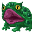

# { .sprite } ViridToxin dartmaw

| Stat | Value |
|---|---|
| Class | reptile |
| HP | 93 |
| Max AP | 10 |
| Attack cost | 3 |
| Move cost | 5 |
| Damage | 6 to 14 |
| Attack chance | 160 |
| Block chance | 77 |
| Damage resistance | 0 |
| Critical skill | 9 |
| Critical multiplier | 2.0 |

## On hit

- **On target:** Corrosive slime (magnitude 4, 5 rounds, 60% chance)

## Drops

| Item | Chance | Qty |
|---|---|---|
| [Poison gland](../items/gland.md) | 8% | 1 |
| [Gold coins](../items/gold.md) | 5% | 2 to 3 |
| [Small rock](../items/rock.md) | 10% | 1 |

## Found on

- [lake_shore_road7a](../maps/lake_shore_road7a.md)
- [lake_shore_road_7](../maps/lake_shore_road_7.md)
- [lake_shore_road_8](../maps/lake_shore_road_8.md)
- [lake_shore_road_8a](../maps/lake_shore_road_8a.md)
- [lake_shore_road_9](../maps/lake_shore_road_9.md)
- [way_to_sullengard_west_0](../maps/way_to_sullengard_west_0.md)

<small>Monster ID: `virid_toxin` · Data from v0.8.18</small>
