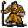

# { .sprite } Breeder of venomscale

| Stat | Value |
|---|---|
| Class | ? |
| HP | 197 |
| Max AP | 10 |
| Attack cost | 3 |
| Move cost | 5 |
| Damage | 0 to 17 |
| Attack chance | 156 |
| Block chance | 57 |
| Damage resistance | 4 |
| Critical skill | 0 |
| Critical multiplier | 0 |

## On hit

- **On target:** Weak Poison (magnitude 2, 5 rounds, 30% chance)

## Drops

| Item | Chance | Qty |
|---|---|---|
| [Gold coins](../items/gold.md) | 30% | 5 to 20 |
| [Poison gland](../items/gland.md) | 20% | 1 to 3 |
| [Venomscale scales](../items/venomscale.md) | 20% | 1 to 3 |
| [Snakeskin gloves](../items/gloves3.md) | 5% | 1 |
| [Fine snakeskin gloves](../items/gloves4.md) | 5% | 1 |
| [Snakeskin boots](../items/boots3.md) | 5% | 1 |
| [Venomscale amulet](../items/vscale_amul.md) | 1% | 1 |

## Found on

- [lodar16](../maps/lodar16.md)
- [lodar19](../maps/lodar19.md)

<small>Monster ID: `vscaleb1` · Data from v0.8.18</small>
