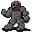

# { .sprite } Rock fiend

| Stat | Value |
|---|---|
| Class | construct |
| HP | 80 |
| Max AP | 10 |
| Attack cost | 3 |
| Move cost | 5 |
| Damage | 6 to 8 |
| Attack chance | 60 |
| Block chance | 80 |
| Damage resistance | 3 |
| Critical skill | 10 |
| Critical multiplier | 2.0 |

!!! note "Immune to critical hits"
    Monsters of this class cannot be critically hit.

## On hit

- **On target:** Petrification (magnitude 1, 4 rounds, 25% chance)

## Drops

| Item | Chance | Qty |
|---|---|---|
| [Gold coins](../items/gold.md) | 25% | 10 to 15 |
| [Azure gem](../items/gem6.md) | 5% | 1 |
| [Stone club](../items/club_stone.md) | 2% | 1 |
| [Small rock](../items/rock.md) | 5% | 1 |

## Found on

- [waterwayacave1](../maps/waterwayacave1.md)
- [waterwayacave2](../maps/waterwayacave2.md)
- [waterwayacave3](../maps/waterwayacave3.md)
- [waterwayacave4](../maps/waterwayacave4.md)

<small>Monster ID: `waterwaycaverockmonster` · Data from v0.8.18</small>
