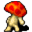

# { .sprite } Weak fungi

| Stat | Value |
|---|---|
| Class | animal |
| HP | 20 |
| Max AP | 10 |
| Attack cost | 5 |
| Move cost | 10 |
| Damage | 1 to 2 |
| Attack chance | 110 |
| Block chance | 10 |
| Damage resistance | 0 |
| Critical skill | 0 |
| Critical multiplier | 0 |

## Drops

| Item | Chance | Qty |
|---|---|---|
| [Spores of the giant mushroom](../items/fungi_panic_spores.md) | 1% | 1 |
| [Bogsten's mushroom](../items/mushroom_bogsten.md) | 5% | 1 |

## Found on

- [bogsten2](../maps/bogsten2.md)
- [bogsten3](../maps/bogsten3.md)
- [mushroom_m2_2](../maps/mushroom_m2_2.md)
- [mushroom_m2_4](../maps/mushroom_m2_4.md)
- [mushroom_m2_5](../maps/mushroom_m2_5.md)
- [mushroom_m3_1](../maps/mushroom_m3_1.md)
- [mushroom_m3_2](../maps/mushroom_m3_2.md)

<small>Monster ID: `weak_fungi` · Data from v0.8.18</small>
