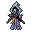

# { .sprite } Bonicksa

<div class="infobox" markdown>

<p class="ib-img">{ .sprite }</p>

| | |
|---|---|
| **Type** | NPC/Enemy (can be spoken to, but can also be fought) |
| **Found in** | Witch house |
| **Class** | Humanoid |
| **HP** | 229–277 |
| **XP when defeated** | 619–768 |
| **Entries in game data** | 3 |
| **Introduced** | [v0.8.8](../versions/0.8.8.md) |

</div>

!!! info "3 entries in the game data"
    The game data defines 3 separate characters named Bonicksa. The game makes a new entry whenever a character needs different behaviour (another conversation later in a quest, another location, other stats). Some are the same person at different story points; others just share a generic name. Here the entries differ in: conversation, combat statistics, loot or shop stock, appearance, movement. Each entry has its own section below.

| Entry | Type | Location | Role | HP |
|---|---|---|---|---|
| [`wicked_witch_first`](#v-wicked_witch_first) | NPC/Enemy | [Witch house](../maps/witch_house.md#pin-npc-wicked_witch_first) | – | 229 |
| [`wicked_witch_second`](#v-wicked_witch_second) | NPC/Enemy | [Witch house](../maps/witch_house.md#pin-npc-wicked_witch_second) | – | 277 |
| [`wicked_witch_third`](#v-wicked_witch_third) | NPC | [Witch house](../maps/witch_house.md#pin-npc-wicked_witch_third) | – | – |

## Witch house (wicked_witch_first) { #v-wicked_witch_first }

**Entry ID:** `wicked_witch_first` · **Type:** NPC/Enemy

**Location:** [Witch house](../maps/witch_house.md#pin-npc-wicked_witch_first)

!!! warning "Can be fought"
    This entry can be talked to, but it can also become an opponent: a conversation with this character can end in combat (a dialogue branch leads to a fight).

### Combat statistics

| Statistic | Value |
|---|---|
| Class | Humanoid |
| HP | 229 |
| XP when defeated | 619 |
| Damage | 13 to 15 |
| Attack chance | 187 |
| Block chance | 152 |
| Damage resistance | 0 |
| Max AP | 12 |
| Attack cost | 4 AP |
| Attacks per turn | 3 |
| Move cost | 3 AP |
| Critical skill | 0 |
| Critical multiplier | – |
| Critical hit chance | None (requires both critical skill and a critical multiplier) |

**On hit:** On target: [Rootsnare](../conditions/rootsnare.md) (magnitude 1, 3 rounds, 25% chance)


<p class="verified">Verified against v0.8.18 monster data and game code (`MonsterTypeParser.java`).</p>

### Drops

| Item | Chance | Qty |
|---|---|---|
| [Music box](../items/music_box.md) | 100% | 1 |

### Locations

| Map | Region | Up to | Notes |
|---|---|---|---|
| [Witch house](../maps/witch_house.md) | – | 1 | – |

### Quests that count defeats

- [A Wicked witch](../quests/wicked_witch.md#stage-60) with stepping on a trigger on [Witch house](../maps/witch_house.md) checks that this enemy has been defeated.

### Quests

- [A Wicked witch](../quests/wicked_witch.md): stage 50

### Dialogue simulator

Set your quest stages and items, then talk to Bonicksa. Same rules as the game: same checks, same options, same effects.

<div class="dlg-sim" data-src="../../assets/dialogue/wicked_witch_first_selector.json" data-npc="Bonicksa" markdown="0"><noscript>The simulator needs JavaScript. The full dialogue is listed below.</noscript></div>

<p class="verified">Rules verified against v0.8.18 game code (ConversationController.java) and dialogue data.</p>

??? quote "Dialogue (7 lines)"

    *Exactly as in the game files. Each line appears once; links jump to where a choice leads.*

    <span id="d-wicked_witch_first-wicked_witch_first_selector"></span>**`wicked_witch_first_selector`** *(silent check: the first matching branch below is taken)*

    - Next *(if latest stage of [A Wicked witch](../quests/wicked_witch.md#stage-40) is 40)* → [wicked_witch_first_10](#d-wicked_witch_first-wicked_witch_first_10)
    - Next *(if latest stage of [A Wicked witch](../quests/wicked_witch.md#stage-50) is 50)* → [wicked_witch_first_30](#d-wicked_witch_first-wicked_witch_first_30)
    - Next *(if latest stage of [A Wicked witch](../quests/wicked_witch.md#stage-55) is 55)* → [wicked_witch_first_45](#d-wicked_witch_first-wicked_witch_first_45)

    <span id="d-wicked_witch_first-wicked_witch_first_10"></span>**`wicked_witch_first_10`** Bonicksa: “Oh my, what have we here? Another brave soul seeking to challenge me?”

    - “[While backing up] Me? No ma'am. I just wandered into the wrong house. Please don't hurt me.” → *conversation ends*
    - “Halt, foul witch! Your reign of darkness ends here!” → [wicked_witch_first_20](#d-wicked_witch_first-wicked_witch_first_20)

    <span id="d-wicked_witch_first-wicked_witch_first_30"></span>**`wicked_witch_first_30`** Bonicksa: “Oh, the "confident child". Please leave me to my business.”


    <span id="d-wicked_witch_first-wicked_witch_first_45"></span>**`wicked_witch_first_45`** Bonicksa: “Oh, this fight will be fun ... for me that is.”

    - “I won't hesitate! Take this!” → *fight starts*

    <span id="d-wicked_witch_first-wicked_witch_first_20"></span>**`wicked_witch_first_20`** Bonicksa: “And with such polite manners too. Come. Come. Take a seat.”

    - “Your tricks won't work on me. Prepare to meet your end!” → [wicked_witch_first_40](#d-wicked_witch_first-wicked_witch_first_40)
    - “Witches don't bother me. I'll leave you be.” → [wicked_witch_first_25](#d-wicked_witch_first-wicked_witch_first_25)

    <span id="d-wicked_witch_first-wicked_witch_first_40"></span>**`wicked_witch_first_40`** Bonicksa: “[laughs] How amusing. You're not the first to try, and you won't be the last. But do go ahead, if you must.”

    - “I won't hesitate! Take this!” → *fight starts*

    <span id="d-wicked_witch_first-wicked_witch_first_25"></span>**`wicked_witch_first_25`** Bonicksa: “How intriguing. Such confidence in your path. We shall see, won't we?” — **effects:** sets stage 50 of [A Wicked witch](../quests/wicked_witch.md#stage-50), starts timer “wicked_witch_despawn_timer”


### Version history

| Version | Change |
|---|---|
| [v0.8.8](../versions/0.8.8.md) | Added<br>Dialogue: 7 lines added |

<p class="verified">Verified against v0.8.18 and every earlier release back to v0.7.0 (game data compared release by release).</p>


??? info "Technical information (wicked_witch_first)"

    | | |
    |---|---|
    | Entry ID | `wicked_witch_first` |
    | Spawn group | `wicked_witch_first` |
    | Loot table | `wicked_witch_first_dl` |
    | Conversation | `wicked_witch_first_selector` |
    | Faction | – |
    | Movement | protectSpawn |
    | Icon | `monsters_phoenix01:8` |
    | Defined in | `res/raw/monsterlist_mt_galmore.json` |

    Raw data:

    ```json
    {
     "id": "wicked_witch_first",
     "name": "Bonicksa",
     "iconID": "monsters_phoenix01:8",
     "maxHP": 229,
     "maxAP": 12,
     "moveCost": 3,
     "unique": 1,
     "monsterClass": "humanoid",
     "movementAggressionType": "protectSpawn",
     "attackDamage": {
      "min": 13,
      "max": 15
     },
     "phraseID": "wicked_witch_first_selector",
     "droplistID": "wicked_witch_first_dl",
     "attackCost": 4,
     "attackChance": 187,
     "blockChance": 152,
     "hitEffect": {
      "conditionsTarget": [
       {
        "condition": "rootsnare",
        "magnitude": 1,
        "duration": 3,
        "chance": "25"
       }
      ]
     }
    }
    ```


## Witch house (wicked_witch_second) { #v-wicked_witch_second }

**Entry ID:** `wicked_witch_second` · **Type:** NPC/Enemy

**Location:** [Witch house](../maps/witch_house.md#pin-npc-wicked_witch_second)

!!! warning "Can be fought"
    This entry can be talked to, but it can also become an opponent: a conversation with this character can end in combat (a dialogue branch leads to a fight).

### Combat statistics

| Statistic | Value |
|---|---|
| Class | Humanoid |
| HP | 277 |
| XP when defeated | 768 |
| Damage | 14 to 17 |
| Attack chance | 207 |
| Block chance | 166 |
| Damage resistance | 0 |
| Max AP | 12 |
| Attack cost | 4 AP |
| Attacks per turn | 3 |
| Move cost | 3 AP |
| Critical skill | 0 |
| Critical multiplier | – |
| Critical hit chance | None (requires both critical skill and a critical multiplier) |

**On hit:** On target: [Rootsnare](../conditions/rootsnare.md) (magnitude 1, 3 rounds, 30% chance)


<p class="verified">Verified against v0.8.18 monster data and game code (`MonsterTypeParser.java`).</p>

### Drops

| Item | Chance | Qty |
|---|---|---|
| [Crystal ball](../items/crystal_ball.md) | 100% | 1 |
| [Rat tail](../items/rat_tail.md) | 100% | 7 to 12 |
| [Witch's candle](../items/witch_candle.md) | 100% | 1 to 2 |

### Locations

| Map | Region | Up to | Notes |
|---|---|---|---|
| [Witch house](../maps/witch_house.md) | – | 1 | Appears later, during a quest |

### Quests that count defeats

- [A Wicked witch](../quests/wicked_witch.md#stage-65) with stepping on a trigger on [Witch house](../maps/witch_house.md) checks that this enemy has been defeated.

### Dialogue simulator

Set your quest stages and items, then talk to Bonicksa. Same rules as the game: same checks, same options, same effects.

<div class="dlg-sim" data-src="../../assets/dialogue/wicked_witch_second_selector.json" data-npc="Bonicksa" markdown="0"><noscript>The simulator needs JavaScript. The full dialogue is listed below.</noscript></div>

<p class="verified">Rules verified against v0.8.18 game code (ConversationController.java) and dialogue data.</p>

??? quote "Dialogue (5 lines)"

    *Exactly as in the game files. Each line appears once; links jump to where a choice leads.*

    <span id="d-wicked_witch_second-wicked_witch_second_selector"></span>**`wicked_witch_second_selector`** *(silent check: the first matching branch below is taken)*

    - Next *(if latest stage of [A Wicked witch](../quests/wicked_witch.md#stage-60) is 60)* → [wicked_witch_second_10](#d-wicked_witch_second-wicked_witch_second_10)

    <span id="d-wicked_witch_second-wicked_witch_second_10"></span>**`wicked_witch_second_10`** Bonicksa: “Bravo, hero! You fell right into my trap.”

    - “What? No, it can't be!” → [wicked_witch_second_20](#d-wicked_witch_second-wicked_witch_second_20)

    <span id="d-wicked_witch_second-wicked_witch_second_20"></span>**`wicked_witch_second_20`** Bonicksa: “Oh, but it is. You see, that old witch you slew was nothing more than an illusion. A clever ruse to manipulate your actions.”

    - “[shocked] Then who are you?” → [wicked_witch_second_30](#d-wicked_witch_second-wicked_witch_second_30)

    <span id="d-wicked_witch_second-wicked_witch_second_30"></span>**`wicked_witch_second_30`** Bonicksa: “I am the real witch, and you've played right into my hands. That display of arrogance, that thirst for victory - perfect for my amusement.”

    - “[angry] You won't get away with this!” → [wicked_witch_second_40](#d-wicked_witch_second-wicked_witch_second_40)

    <span id="d-wicked_witch_second-wicked_witch_second_40"></span>**`wicked_witch_second_40`** Bonicksa: “[chuckles] You can certainly try, my dear hero. But your bravado has already cost you.”

    - “You're the one that will pay!” → *fight starts*


### Version history

| Version | Change |
|---|---|
| [v0.8.8](../versions/0.8.8.md) | Added<br>Dialogue: 5 lines added |

<p class="verified">Verified against v0.8.18 and every earlier release back to v0.7.0 (game data compared release by release).</p>


??? info "Technical information (wicked_witch_second)"

    | | |
    |---|---|
    | Entry ID | `wicked_witch_second` |
    | Spawn group | `wicked_witch_second` |
    | Loot table | `wicked_witch_second_dl` |
    | Conversation | `wicked_witch_second_selector` |
    | Faction | – |
    | Movement | protectSpawn |
    | Icon | `monsters_phoenix01:9` |
    | Defined in | `res/raw/monsterlist_mt_galmore.json` |

    Raw data:

    ```json
    {
     "id": "wicked_witch_second",
     "name": "Bonicksa",
     "iconID": "monsters_phoenix01:9",
     "maxHP": 277,
     "maxAP": 12,
     "moveCost": 3,
     "unique": 1,
     "monsterClass": "humanoid",
     "movementAggressionType": "protectSpawn",
     "attackDamage": {
      "min": 14,
      "max": 17
     },
     "phraseID": "wicked_witch_second_selector",
     "droplistID": "wicked_witch_second_dl",
     "attackCost": 4,
     "attackChance": 207,
     "blockChance": 166,
     "hitEffect": {
      "conditionsTarget": [
       {
        "condition": "rootsnare",
        "magnitude": 1,
        "duration": 3,
        "chance": "30"
       }
      ]
     }
    }
    ```


## Witch house (wicked_witch_third) { #v-wicked_witch_third }

**Entry ID:** `wicked_witch_third` · **Type:** NPC

**Location:** [Witch house](../maps/witch_house.md#pin-npc-wicked_witch_third)

### Quests

- [A Wicked witch](../quests/wicked_witch.md): stage 70
- [Sutdover story flags (hidden flag)](../quests/sutdover_hidden.md): stage 1

### Dialogue simulator

Set your quest stages and items, then talk to Bonicksa. Same rules as the game: same checks, same options, same effects.

<div class="dlg-sim" data-src="../../assets/dialogue/wicked_witch_third_selector.json" data-npc="Bonicksa" markdown="0"><noscript>The simulator needs JavaScript. The full dialogue is listed below.</noscript></div>

<p class="verified">Rules verified against v0.8.18 game code (ConversationController.java) and dialogue data.</p>

??? quote "Dialogue (5 lines)"

    *Exactly as in the game files. Each line appears once; links jump to where a choice leads.*

    <span id="d-wicked_witch_third-wicked_witch_third_selector"></span>**`wicked_witch_third_selector`** *(silent check: the first matching branch below is taken)*

    - “It's over, witch!” *(if latest stage of [A Wicked witch](../quests/wicked_witch.md#stage-65) is 65)* → [wicked_witch_third_10](#d-wicked_witch_third-wicked_witch_third_10)
    - “What did you mean when you said "what lies ahead"?” *(if reached stage 70 of [A Wicked witch](../quests/wicked_witch.md#stage-70))* → [wicked_witch_third_40](#d-wicked_witch_third-wicked_witch_third_40)

    <span id="d-wicked_witch_third-wicked_witch_third_10"></span>**`wicked_witch_third_10`** Bonicksa: “[weakened] Yes, yes, you've bested me. Congratulations, but have you really won?”

    - “[panting] Why all this deception?” → [wicked_witch_third_20](#d-wicked_witch_third-wicked_witch_third_20)

    <span id="d-wicked_witch_third-wicked_witch_third_40"></span>**`wicked_witch_third_40`** Bonicksa: “Leave me now, child before you end up like that young girl you killed.”


    <span id="d-wicked_witch_third-wicked_witch_third_20"></span>**`wicked_witch_third_20`** Bonicksa: “Oh, just a bit of entertainment. And for that, you get a big reward: You get to live.”

    - “[disgruntled] Is this some kind of sick game to you?” → [wicked_witch_third_30](#d-wicked_witch_third-wicked_witch_third_30)

    <span id="d-wicked_witch_third-wicked_witch_third_30"></span>**`wicked_witch_third_30`** Bonicksa: “[smirks] Perhaps. But remember, hero, life's full of surprises. You may have won this time, but who's to say what lies ahead?” — **effects:** sets stage 70 of [A Wicked witch](../quests/wicked_witch.md#stage-70), sets stage 1 of [Sutdover story flags (hidden flag)](../quests/sutdover_hidden.md#stage-1), spawns monsters on lake_shore_road_0, changes map lake_shore_road_0


### Version history

| Version | Change |
|---|---|
| [v0.8.8](../versions/0.8.8.md) | Added<br>Dialogue: 5 lines added |

<p class="verified">Verified against v0.8.18 and every earlier release back to v0.7.0 (game data compared release by release).</p>


??? info "Technical information (wicked_witch_third)"

    | | |
    |---|---|
    | Entry ID | `wicked_witch_third` |
    | Spawn group | `wicked_witch_third` |
    | Loot table | – |
    | Conversation | `wicked_witch_third_selector` |
    | Faction | – |
    | Movement | – |
    | Icon | `monsters_phoenix01:9` |
    | Defined in | `res/raw/monsterlist_mt_galmore.json` |

    Raw data:

    ```json
    {
     "id": "wicked_witch_third",
     "name": "Bonicksa",
     "iconID": "monsters_phoenix01:9",
     "unique": 1,
     "monsterClass": "humanoid",
     "phraseID": "wicked_witch_third_selector"
    }
    ```


??? info "How the XP value is calculated"

    The game computes each enemy's experience value when it loads the data (`MonsterTypeParser.java`):

    XP = ⌈(attacks per turn × attack chance × average damage × (1 + critical skill × critical multiplier) × 3 + HP × (1 + block chance) + 9 × damage resistance) × 0.7⌉

    Percentages are used as fractions (e.g. 60% = 0.6). Enemies whose attacks inflict a condition are worth 50 XP more. The More Exp skill adds a percentage on top.


## Community notes

<small>Written by players, not generated from game data. **Observations**: what players notice in-game · **Lore**: the in-world story · **Trivia**: real-world facts, references, development history · **Theory / speculation**: unconfirmed ideas; may just be unfinished content</small>

### Observations

*No notes yet. Contributions are welcome: [add a note](https://github.com/asdfghjkl628/Andor-s-Trail-Wikiiii/new/main/notes/monsters?filename=wicked_witch_first.md&value=%23%23%20Observations%0A%0A%3C%21--%20what%20players%20notice%20in-game%20--%3E%0A%0A%23%23%20Lore%0A%0A%3C%21--%20the%20in-world%20story%20--%3E%0A%0A%23%23%20Trivia%0A%0A%3C%21--%20real-world%20facts%2C%20references%2C%20development%20history%20--%3E%0A%0A%23%23%20Theory%20/%20speculation%0A%0A%3C%21--%20unconfirmed%20ideas%3B%20may%20just%20be%20unfinished%20content%20--%3E%0A).*

### Lore

*No notes yet. Contributions are welcome: [add a note](https://github.com/asdfghjkl628/Andor-s-Trail-Wikiiii/new/main/notes/monsters?filename=wicked_witch_first.md&value=%23%23%20Observations%0A%0A%3C%21--%20what%20players%20notice%20in-game%20--%3E%0A%0A%23%23%20Lore%0A%0A%3C%21--%20the%20in-world%20story%20--%3E%0A%0A%23%23%20Trivia%0A%0A%3C%21--%20real-world%20facts%2C%20references%2C%20development%20history%20--%3E%0A%0A%23%23%20Theory%20/%20speculation%0A%0A%3C%21--%20unconfirmed%20ideas%3B%20may%20just%20be%20unfinished%20content%20--%3E%0A).*

### Trivia

*No notes yet. Contributions are welcome: [add a note](https://github.com/asdfghjkl628/Andor-s-Trail-Wikiiii/new/main/notes/monsters?filename=wicked_witch_first.md&value=%23%23%20Observations%0A%0A%3C%21--%20what%20players%20notice%20in-game%20--%3E%0A%0A%23%23%20Lore%0A%0A%3C%21--%20the%20in-world%20story%20--%3E%0A%0A%23%23%20Trivia%0A%0A%3C%21--%20real-world%20facts%2C%20references%2C%20development%20history%20--%3E%0A%0A%23%23%20Theory%20/%20speculation%0A%0A%3C%21--%20unconfirmed%20ideas%3B%20may%20just%20be%20unfinished%20content%20--%3E%0A).*

### Theory / speculation

*No notes yet. Contributions are welcome: [add a note](https://github.com/asdfghjkl628/Andor-s-Trail-Wikiiii/new/main/notes/monsters?filename=wicked_witch_first.md&value=%23%23%20Observations%0A%0A%3C%21--%20what%20players%20notice%20in-game%20--%3E%0A%0A%23%23%20Lore%0A%0A%3C%21--%20the%20in-world%20story%20--%3E%0A%0A%23%23%20Trivia%0A%0A%3C%21--%20real-world%20facts%2C%20references%2C%20development%20history%20--%3E%0A%0A%23%23%20Theory%20/%20speculation%0A%0A%3C%21--%20unconfirmed%20ideas%3B%20may%20just%20be%20unfinished%20content%20--%3E%0A).*


<small>Data from v0.8.18</small>
