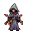

# { .sprite } Bonicksa

| Stat | Value |
|---|---|
| Class | humanoid |
| HP | 0 |
| Max AP | 10 |
| Attack cost | 10 |
| Move cost | 10 |
| Damage | 0 |
| Attack chance | 0 |
| Block chance | 0 |
| Damage resistance | 0 |
| Critical skill | 0 |
| Critical multiplier | 0 |

## Found on

- [witch_house](../maps/witch_house.md)

## Quests

- [A Wicked witch](../quests/wicked_witch.md): stages 70
- [Sutdove_nondisplay (hidden flag)](../quests/sutdover_hidden.md): stages 1

## Dialogue simulator

Set up your situation (quest stages, items, kills…), then talk to Bonicksa. The simulator follows the game's own rules: it takes the same silent checks, offers only the options you'd really see, and applies their effects (quest stages, items handed over, rewards) as you go.

<noscript>The simulator needs JavaScript. The full dialogue is listed below.</noscript>

Rules verified against v0.8.18 game code (ConversationController.java) and dialogue data.

??? quote "Dialogue (5 lines)"

    *What the dialogue says, exactly as in the game files. Lines are listed once; links jump to the line a choice leads to.*

    **`wicked_witch_third_selector`** *(silent check: the first matching branch below is taken)*

    - “It's over, witch!” *(if latest stage of [A Wicked witch](../quests/wicked_witch.md#stage-65) is 65)* → [wicked_witch_third_10](#d-wicked_witch_third_10)
    - “What did you mean when you said "what lies ahead"?” *(if reached stage 70 of [A Wicked witch](../quests/wicked_witch.md#stage-70))* → [wicked_witch_third_40](#d-wicked_witch_third_40)

    **`wicked_witch_third_10`** Bonicksa: “[weakened] Yes, yes, you've bested me. Congratulations, but have you really won?”

    - “[panting] Why all this deception?” → [wicked_witch_third_20](#d-wicked_witch_third_20)

    **`wicked_witch_third_40`** Bonicksa: “Leave me now, child before you end up like that young girl you killed.”

    **`wicked_witch_third_20`** Bonicksa: “Oh, just a bit of entertainment. And for that, you get a big reward: You get to live.”

    - “[disgruntled] Is this some kind of sick game to you?” → [wicked_witch_third_30](#d-wicked_witch_third_30)

    **`wicked_witch_third_30`** Bonicksa: “[smirks] Perhaps. But remember, hero, life's full of surprises. You may have won this time, but who's to say what lies ahead?” — **effects:** sets stage 70 of [A Wicked witch](../quests/wicked_witch.md#stage-70), sets stage 1 of [Sutdove_nondisplay (hidden flag)](../quests/sutdover_hidden.md#stage-1), spawns monsters on lake_shore_road_0, changes map lake_shore_road_0

## Version history

| Version | Change |
|---|---|
| [v0.8.8](../versions/0.8.8.md) | Added Dialogue: 5 lines added |

Verified against v0.8.18 and every earlier release back to v0.7.0 (game data compared release by release).

## Community notes

<small>Written by players, not generated from game data. **Observations**: what players notice in-game · **Lore**: the in-world story · **Trivia**: real-world facts, references, development history · **Theory / speculation**: unconfirmed ideas; may just be unfinished content</small>

### Observations

*Nothing here yet. Know something? [Add it](https://github.com/asdfghjkl628/Andor-s-Trail-Wikiiii/new/main/notes/monsters?filename=wicked_witch_third.md&value=%23%23%20Observations%0A%0A%3C%21--%20what%20players%20notice%20in-game%20--%3E%0A%0A%23%23%20Lore%0A%0A%3C%21--%20the%20in-world%20story%20--%3E%0A%0A%23%23%20Trivia%0A%0A%3C%21--%20real-world%20facts%2C%20references%2C%20development%20history%20--%3E%0A%0A%23%23%20Theory%20/%20speculation%0A%0A%3C%21--%20unconfirmed%20ideas%3B%20may%20just%20be%20unfinished%20content%20--%3E%0A).*

### Lore

*Nothing here yet. Know something? [Add it](https://github.com/asdfghjkl628/Andor-s-Trail-Wikiiii/new/main/notes/monsters?filename=wicked_witch_third.md&value=%23%23%20Observations%0A%0A%3C%21--%20what%20players%20notice%20in-game%20--%3E%0A%0A%23%23%20Lore%0A%0A%3C%21--%20the%20in-world%20story%20--%3E%0A%0A%23%23%20Trivia%0A%0A%3C%21--%20real-world%20facts%2C%20references%2C%20development%20history%20--%3E%0A%0A%23%23%20Theory%20/%20speculation%0A%0A%3C%21--%20unconfirmed%20ideas%3B%20may%20just%20be%20unfinished%20content%20--%3E%0A).*

### Trivia

*Nothing here yet. Know something? [Add it](https://github.com/asdfghjkl628/Andor-s-Trail-Wikiiii/new/main/notes/monsters?filename=wicked_witch_third.md&value=%23%23%20Observations%0A%0A%3C%21--%20what%20players%20notice%20in-game%20--%3E%0A%0A%23%23%20Lore%0A%0A%3C%21--%20the%20in-world%20story%20--%3E%0A%0A%23%23%20Trivia%0A%0A%3C%21--%20real-world%20facts%2C%20references%2C%20development%20history%20--%3E%0A%0A%23%23%20Theory%20/%20speculation%0A%0A%3C%21--%20unconfirmed%20ideas%3B%20may%20just%20be%20unfinished%20content%20--%3E%0A).*

### Theory / speculation

*Nothing here yet. Know something? [Add it](https://github.com/asdfghjkl628/Andor-s-Trail-Wikiiii/new/main/notes/monsters?filename=wicked_witch_third.md&value=%23%23%20Observations%0A%0A%3C%21--%20what%20players%20notice%20in-game%20--%3E%0A%0A%23%23%20Lore%0A%0A%3C%21--%20the%20in-world%20story%20--%3E%0A%0A%23%23%20Trivia%0A%0A%3C%21--%20real-world%20facts%2C%20references%2C%20development%20history%20--%3E%0A%0A%23%23%20Theory%20/%20speculation%0A%0A%3C%21--%20unconfirmed%20ideas%3B%20may%20just%20be%20unfinished%20content%20--%3E%0A).*

<small>Monster ID: `wicked_witch_third` · Data from v0.8.18</small>
