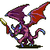

# { .sprite } Winged demon

**Where to find Winged demon:** [Flagstone 4](../maps/flagstone4.md#pin-npc-winged_demon)

<div class="infobox" markdown>

<p class="ib-img">{ .sprite }</p>

| | |
|---|---|
| **Type** | NPC/Enemy (can be spoken to, but can also be fought) |
| **Found in** | Flagstone 4 |
| **Class** | Demon |
| **HP** | 82 |
| **XP when defeated** | 166 |
| **Immune to critical hits** | Yes |
| **Entry ID** | `winged_demon` |
| **Introduced** | v0.7.0 or earlier |

</div>

!!! warning "Can be fought"
    This entry can be talked to, but it can also become an opponent: a conversation with this character can end in combat (a dialogue branch leads to a fight).

## Combat statistics

| Statistic | Value |
|---|---|
| Class | Demon |
| HP | 82 |
| XP when defeated | 166 |
| Damage | 4 to 12 |
| Attack chance | 90 |
| Block chance | 70 |
| Damage resistance | 5 |
| Max AP | 10 |
| Attack cost | 5 AP |
| Attacks per turn | 2 |
| Move cost | 10 AP |
| Critical skill | 10 |
| Critical multiplier | 2.0 |
| Critical hit chance | 9% |

!!! note "Immune to critical hits"
    Ghosts, constructs and demons cannot receive critical hits.


<p class="verified">Verified against v0.8.18 monster data and game code (`MonsterTypeParser.java`).</p>

## Drops

| Item | Chance | Qty |
|---|---|---|
| [Gold coins](../items/gold.md) | 100% | 62 |
| [Sharpened gem](../items/gem4.md) | 100% | 1 |
| [Regular potion of health](../items/health.md) | 100% | 3 |
| [Flagstone's pride](../items/sword_flagstone.md) | 100% | 1 |
| [Jinxed ring of damage resistance](../items/ring_jinxed1.md) | 100% | 1 |

## Locations

| Map | Region | Up to | Notes |
|---|---|---|---|
| [Flagstone 4](../maps/flagstone4.md) | – | 1 | – |

## Quests

- [Ancient secrets](../quests/flagstone.md): stage 50

## Dialogue simulator

Set your quest stages and items, then talk to Winged demon. Same rules as the game: same checks, same options, same effects.

<div class="dlg-sim" data-src="../../assets/dialogue/flagstone_guard2.json" data-npc="Winged demon" markdown="0"><noscript>The simulator needs JavaScript. The full dialogue is listed below.</noscript></div>

<p class="verified">Rules verified against v0.8.18 game code (ConversationController.java) and dialogue data.</p>

??? quote "Dialogue (3 lines)"

    *Exactly as in the game files. Each line appears once; links jump to where a choice leads.*

    <span id="d-flagstone_guard2"></span>**`flagstone_guard2`** Winged demon: “What, a mortal in here that is not marked by my touch?” — **effects:** sets stage 50 of [Ancient secrets](../quests/flagstone.md#stage-50)

    - Next → [flagstone_guard2_2](#d-flagstone_guard2_2)

    <span id="d-flagstone_guard2_2"></span>**`flagstone_guard2_2`** Winged demon: “You seem delicious and soft, will you be part of the feast?”

    - Next → [flagstone_guard2_3](#d-flagstone_guard2_3)

    <span id="d-flagstone_guard2_3"></span>**`flagstone_guard2_3`** Winged demon: “Yes, I think you will. My undead army will spread far outside of Flagstone once I am done with you.”

    - “By the Shadow, you must be stopped!” → *fight starts*
    - “No! This land must be protected from the undead!” → *fight starts*


## Version history

| Version | Change |
|---|---|
| [v0.7.0](../versions/0.7.0.md) | Present in v0.7.0 (earliest release tracked) |
| [v0.7.2](../versions/0.7.2.md) | Size: removed (was 2x2) |

<p class="verified">Verified against v0.8.18 and every earlier release back to v0.7.0 (game data compared release by release).</p>


??? info "Technical information"

    | | |
    |---|---|
    | Entry ID | `winged_demon` |
    | Spawn group | `flagstone_guard2` |
    | Loot table | `flagstone_guard2` |
    | Conversation | `flagstone_guard2` |
    | Faction | – |
    | Movement | – |
    | Icon | `monsters_demon1:0` |
    | Defined in | `res/raw/monsterlist_wilderness.json` |

    Raw data:

    ```json
    {
     "id": "winged_demon",
     "name": "Winged demon",
     "iconID": "monsters_demon1:0",
     "maxHP": 82,
     "unique": 1,
     "monsterClass": "demon",
     "attackDamage": {
      "min": 4,
      "max": 12
     },
     "spawnGroup": "flagstone_guard2",
     "phraseID": "flagstone_guard2",
     "droplistID": "flagstone_guard2",
     "attackCost": 5,
     "attackChance": 90,
     "criticalSkill": 10,
     "criticalMultiplier": 2.0,
     "blockChance": 70,
     "damageResistance": 5
    }
    ```


??? info "How the XP value is calculated"

    The game computes each enemy's experience value when it loads the data (`MonsterTypeParser.java`):

    XP = ⌈(attacks per turn × attack chance × average damage × (1 + critical skill × critical multiplier) × 3 + HP × (1 + block chance) + 9 × damage resistance) × 0.7⌉

    Percentages are used as fractions (e.g. 60% = 0.6). Enemies whose attacks inflict a condition are worth 50 XP more. The More Exp skill adds a percentage on top.


## Community notes

<small>Written by players, not generated from game data. **Observations**: what players notice in-game · **Lore**: the in-world story · **Trivia**: real-world facts, references, development history · **Theory / speculation**: unconfirmed ideas; may just be unfinished content</small>

### Observations

*No notes yet. Contributions are welcome: [add a note](https://github.com/asdfghjkl628/Andor-s-Trail-Wikiiii/new/main/notes/monsters?filename=winged_demon.md&value=%23%23%20Observations%0A%0A%3C%21--%20what%20players%20notice%20in-game%20--%3E%0A%0A%23%23%20Lore%0A%0A%3C%21--%20the%20in-world%20story%20--%3E%0A%0A%23%23%20Trivia%0A%0A%3C%21--%20real-world%20facts%2C%20references%2C%20development%20history%20--%3E%0A%0A%23%23%20Theory%20/%20speculation%0A%0A%3C%21--%20unconfirmed%20ideas%3B%20may%20just%20be%20unfinished%20content%20--%3E%0A).*

### Lore

*No notes yet. Contributions are welcome: [add a note](https://github.com/asdfghjkl628/Andor-s-Trail-Wikiiii/new/main/notes/monsters?filename=winged_demon.md&value=%23%23%20Observations%0A%0A%3C%21--%20what%20players%20notice%20in-game%20--%3E%0A%0A%23%23%20Lore%0A%0A%3C%21--%20the%20in-world%20story%20--%3E%0A%0A%23%23%20Trivia%0A%0A%3C%21--%20real-world%20facts%2C%20references%2C%20development%20history%20--%3E%0A%0A%23%23%20Theory%20/%20speculation%0A%0A%3C%21--%20unconfirmed%20ideas%3B%20may%20just%20be%20unfinished%20content%20--%3E%0A).*

### Trivia

*No notes yet. Contributions are welcome: [add a note](https://github.com/asdfghjkl628/Andor-s-Trail-Wikiiii/new/main/notes/monsters?filename=winged_demon.md&value=%23%23%20Observations%0A%0A%3C%21--%20what%20players%20notice%20in-game%20--%3E%0A%0A%23%23%20Lore%0A%0A%3C%21--%20the%20in-world%20story%20--%3E%0A%0A%23%23%20Trivia%0A%0A%3C%21--%20real-world%20facts%2C%20references%2C%20development%20history%20--%3E%0A%0A%23%23%20Theory%20/%20speculation%0A%0A%3C%21--%20unconfirmed%20ideas%3B%20may%20just%20be%20unfinished%20content%20--%3E%0A).*

### Theory / speculation

*No notes yet. Contributions are welcome: [add a note](https://github.com/asdfghjkl628/Andor-s-Trail-Wikiiii/new/main/notes/monsters?filename=winged_demon.md&value=%23%23%20Observations%0A%0A%3C%21--%20what%20players%20notice%20in-game%20--%3E%0A%0A%23%23%20Lore%0A%0A%3C%21--%20the%20in-world%20story%20--%3E%0A%0A%23%23%20Trivia%0A%0A%3C%21--%20real-world%20facts%2C%20references%2C%20development%20history%20--%3E%0A%0A%23%23%20Theory%20/%20speculation%0A%0A%3C%21--%20unconfirmed%20ideas%3B%20may%20just%20be%20unfinished%20content%20--%3E%0A).*


<small>Data from v0.8.18</small>
