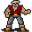

# { .sprite } Wulfric

| Stat | Value |
|---|---|
| Class | humanoid |
| HP | 0 |
| Max AP | 10 |
| Attack cost | 10 |
| Move cost | 10 |
| Damage | 0 |
| Attack chance | 0 |
| Block chance | 0 |
| Damage resistance | 0 |
| Critical skill | 0 |
| Critical multiplier | 0 |

## Found on

- [way_to_wexlow1](../maps/way_to_wexlow1.md)

??? quote "Dialogue (6 lines)"

    *What the dialogue says, exactly as in the game files. Lines are listed once; links jump to the line a choice leads to.*

    **`wulfric_ip`** Wulfric: “Hey there. I am "Wulfric the Wonderful".”

    - “I am wondering...” → [wulfric_wonder](#d-wulfric_wonder)

    **`wulfric_wonder`** Wulfric: “Why I'm so wonderful?”

    - “Well, yeah, but no, not really.” → [wulfric_ask_about_andor](#d-wulfric_ask_about_andor)
    - “Do you know where the residents of Wexlow Village are?” *(if reached stage 11 of [feygard_nondisplayed (hidden flag)](../quests/feygard_nondisplayed.md#stage-11); NOT reached stage 10 of [Echoes of enchantment](../quests/echoes_of_enchantment.md#stage-10))* → [wulfric_wexlow](#d-wulfric_wexlow)
    - “Yes, why are you so wonderful?” → [wulfric_wonder_answer](#d-wulfric_wonder_answer)

    **`wulfric_ask_about_andor`** Wulfric: “What then?”

    - “Whether you've seen my brother, Andor or not. You see, he looks like me, but not as good looking.” → [wulfric_andor](#d-wulfric_andor)

    **`wulfric_wexlow`** Wulfric: “Wexlow Village? Where is that?”

    - “Oh, nevermind.” → *conversation ends*

    **`wulfric_wonder_answer`** Wulfric: “Because all the ladies say that I am.”

    **`wulfric_andor`** Wulfric: “Nope. Sorry. Is there anything else?”

    - “I am wondering...” → [wulfric_wonder](#d-wulfric_wonder)
    - “Nope.” → *conversation ends*

## Version history

| Version | Change |
|---|---|
| [v0.8.12.1](../versions/0.8.12.1.md) | Added Dialogue: 6 lines added |

Verified against v0.8.18 and every earlier release back to v0.7.0 (game data compared release by release).

## Community notes

<small>Written by players, not generated from game data. **Observations**: what players notice in-game · **Lore**: the in-world story · **Trivia**: real-world facts, references, development history · **Theory / speculation**: unconfirmed ideas; may just be unfinished content</small>

### Observations

*Nothing here yet. Know something? [Add it](https://github.com/asdfghjkl628/Andor-s-Trail-Wikiiii/new/main/notes/monsters?filename=wulfric.md&value=%23%23%20Observations%0A%0A%3C%21--%20what%20players%20notice%20in-game%20--%3E%0A%0A%23%23%20Lore%0A%0A%3C%21--%20the%20in-world%20story%20--%3E%0A%0A%23%23%20Trivia%0A%0A%3C%21--%20real-world%20facts%2C%20references%2C%20development%20history%20--%3E%0A%0A%23%23%20Theory%20/%20speculation%0A%0A%3C%21--%20unconfirmed%20ideas%3B%20may%20just%20be%20unfinished%20content%20--%3E%0A).*

### Lore

*Nothing here yet. Know something? [Add it](https://github.com/asdfghjkl628/Andor-s-Trail-Wikiiii/new/main/notes/monsters?filename=wulfric.md&value=%23%23%20Observations%0A%0A%3C%21--%20what%20players%20notice%20in-game%20--%3E%0A%0A%23%23%20Lore%0A%0A%3C%21--%20the%20in-world%20story%20--%3E%0A%0A%23%23%20Trivia%0A%0A%3C%21--%20real-world%20facts%2C%20references%2C%20development%20history%20--%3E%0A%0A%23%23%20Theory%20/%20speculation%0A%0A%3C%21--%20unconfirmed%20ideas%3B%20may%20just%20be%20unfinished%20content%20--%3E%0A).*

### Trivia

*Nothing here yet. Know something? [Add it](https://github.com/asdfghjkl628/Andor-s-Trail-Wikiiii/new/main/notes/monsters?filename=wulfric.md&value=%23%23%20Observations%0A%0A%3C%21--%20what%20players%20notice%20in-game%20--%3E%0A%0A%23%23%20Lore%0A%0A%3C%21--%20the%20in-world%20story%20--%3E%0A%0A%23%23%20Trivia%0A%0A%3C%21--%20real-world%20facts%2C%20references%2C%20development%20history%20--%3E%0A%0A%23%23%20Theory%20/%20speculation%0A%0A%3C%21--%20unconfirmed%20ideas%3B%20may%20just%20be%20unfinished%20content%20--%3E%0A).*

### Theory / speculation

*Nothing here yet. Know something? [Add it](https://github.com/asdfghjkl628/Andor-s-Trail-Wikiiii/new/main/notes/monsters?filename=wulfric.md&value=%23%23%20Observations%0A%0A%3C%21--%20what%20players%20notice%20in-game%20--%3E%0A%0A%23%23%20Lore%0A%0A%3C%21--%20the%20in-world%20story%20--%3E%0A%0A%23%23%20Trivia%0A%0A%3C%21--%20real-world%20facts%2C%20references%2C%20development%20history%20--%3E%0A%0A%23%23%20Theory%20/%20speculation%0A%0A%3C%21--%20unconfirmed%20ideas%3B%20may%20just%20be%20unfinished%20content%20--%3E%0A).*

<small>Monster ID: `wulfric` · Data from v0.8.18</small>
