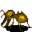

# { .sprite } Yellow cave ant

| Stat | Value |
|---|---|
| Class | insect |
| HP | 20 |
| Max AP | 10 |
| Attack cost | 3 |
| Move cost | 10 |
| Damage | 1 |
| Attack chance | 30 |
| Block chance | 80 |
| Damage resistance | 0 |
| Critical skill | 0 |
| Critical multiplier | 0 |

## Drops

| Item | Chance | Qty |
|---|---|---|
| [Gold coins](../items/gold.md) | 70% | 2 to 4 |
| [Insect shell](../items/shell.md) | 30% | 1 |

## Found on

- [jan_pitcave1](../maps/jan_pitcave1.md)
- [jan_pitcave2](../maps/jan_pitcave2.md)

<small>Monster ID: `yellow_cave_ant` · Data from v0.8.18</small>
