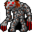

# { .sprite } Young gornaud

**Found in:** Blackwater Mountain: [Blackwater mountain 15](../maps/blackwater_mountain15.md), Blackwater Mountain: [Blackwater mountain 16](../maps/blackwater_mountain16.md), Blackwater Mountain: [Blackwater mountain 53](../maps/blackwater_mountain53.md), Blackwater Mountain: [Blackwater mountain 56](../maps/blackwater_mountain56.md) (+15 more)

<div class="infobox" markdown>

<p class="ib-img"></p>

| | |
|---|---|
| **Type** | Enemy (hostile on sight) |
| **Found in** | Stoutford, Blackwater Mountain, Prim |
| **Class** | Giant |
| **HP** | 70 |
| **XP when defeated** | 146 |
| **Introduced** | v0.7.0 or earlier |

</div>

## Combat

| | |
|---|---|
| Class | Giant |
| HP | 70 |
| XP when defeated | 146 |
| Damage | 0 to 15 |
| AC | 70 |
| BC | 50 |
| DR | 0 |
| Attacks per turn | 2 (5 AP each, 10 AP) |
| Crit chance | none |

**Its hits:** On target: [Dazed](../conditions/dazed.md) (magnitude 1, 5 rounds, 20% chance)


<p class="verified">Verified against v0.8.18 monster data.</p>

## Drops

| Item | Chance | Qty |
|---|---|---|
| [Gold coins](../items/gold.md) | 70% | 1 to 30 |
| [Meat](../items/meat.md) | 5% | 1 |
| [Animal hair](../items/hair.md) | 10% | 1 |

## Locations

| Map | Region | Up to | Notes |
|---|---|---|---|
| [Blackwater mountain 1](../maps/blackwater_mountain1.md) | Stoutford | 2 | – |
| [Blackwater mountain 15](../maps/blackwater_mountain15.md) | Blackwater Mountain | 5 | – |
| [Blackwater mountain 16](../maps/blackwater_mountain16.md) | Blackwater Mountain | 5 | – |
| [Blackwater mountain 2](../maps/blackwater_mountain2.md) | – | 6 | – |
| [Blackwater mountain 3](../maps/blackwater_mountain3.md) | – | 1 | – |
| [Blackwater mountain 4](../maps/blackwater_mountain4.md) | – | 1 | – |
| [Blackwater mountain 4a](../maps/blackwater_mountain4a.md) | – | 3 | – |
| [Blackwater mountain 5](../maps/blackwater_mountain5.md) | – | 3 | – |
| [Blackwater mountain 53](../maps/blackwater_mountain53.md) | Blackwater Mountain | 3 | – |
| [Blackwater mountain 56](../maps/blackwater_mountain56.md) | Blackwater Mountain | 6 | – |
| [Blackwater mountain 5a](../maps/blackwater_mountain5a.md) | – | 4 | – |
| [Blackwater mountain 7](../maps/blackwater_mountain7.md) | Prim | 5 | – |
| [Blackwater mountain 9](../maps/blackwater_mountain9.md) | Prim | 2 | – |
| [Bwmfill 1](../maps/bwmfill1.md) | Blackwater Mountain | 2 | – |
| [Bwmfill 2](../maps/bwmfill2.md) | Blackwater Mountain | 1 | – |
| [Bwmfill 4](../maps/bwmfill4.md) | Blackwater Mountain | 1 | – |
| [Bwmfill 5](../maps/bwmfill5.md) | Blackwater Mountain | 1 | – |
| [Bwmfill 6](../maps/bwmfill6.md) | Blackwater Mountain | 1 | – |
| [Bwmfill 7](../maps/bwmfill7.md) | Blackwater Mountain | 1 | – |


## Version history

| Version | Change |
|---|---|
| [v0.7.0](../versions/0.7.0.md) | Present in v0.7.0 (earliest release tracked) |
| [v0.7.2](../versions/0.7.2.md) | On hit, condition on target: [Dazed](../conditions/dazed.md) (magnitude 1, 5 rounds, 20% chance) → (magnitude 1, 5 rounds, 20% chance) |

<p class="verified">Verified against v0.8.18 and every earlier release back to v0.7.0 (game data compared release by release).</p>


## Behind the scenes

*How the game data handles this character. Not needed for playing.*

??? info "How the XP value is calculated"

    The game computes each enemy's experience value when it loads the data (`MonsterTypeParser.java`):

    XP = ⌈(attacks per turn × attack chance × average damage × (1 + critical skill × critical multiplier) × 3 + HP × (1 + block chance) + 9 × damage resistance) × 0.7⌉

    Percentages are used as fractions (e.g. 60% = 0.6). Enemies whose attacks inflict a condition are worth 50 XP more. The More Exp skill adds a percentage on top.

??? info "Technical information"

    | | |
    |---|---|
    | Entry ID | `young_gornaud` |
    | Type (wiki) | Enemy |
    | Spawn group | `gornaud_1` |
    | Loot table | `gornaud_1` |
    | Conversation | – |
    | Faction | – |
    | Movement | – |
    | Icon | `monsters_rltiles2:29` |
    | Defined in | `res/raw/monsterlist_v069_monsters.json` |

    Raw data:

    ```json
    {
     "id": "young_gornaud",
     "name": "Young gornaud",
     "iconID": "monsters_rltiles2:29",
     "maxHP": 70,
     "maxAP": 10,
     "moveCost": 5,
     "monsterClass": "giant",
     "attackDamage": {
      "min": 0,
      "max": 15
     },
     "spawnGroup": "gornaud_1",
     "droplistID": "gornaud_1",
     "attackCost": 5,
     "attackChance": 70,
     "blockChance": 50,
     "hitEffect": {
      "conditionsTarget": [
       {
        "condition": "dazed",
        "magnitude": 1,
        "duration": 5,
        "chance": "20"
       }
      ]
     }
    }
    ```


## Community notes

<small>Written by players, not generated from game data. **Observations**: what players notice in-game · **Lore**: the in-world story · **Trivia**: real-world facts, references, development history · **Theory / speculation**: unconfirmed ideas; may just be unfinished content</small>

### Observations

*No notes yet. Contributions are welcome: [add a note](https://github.com/asdfghjkl628/Andor-s-Trail-Wikiiii/new/main/notes/monsters?filename=young_gornaud.md&value=%23%23%20Observations%0A%0A%3C%21--%20what%20players%20notice%20in-game%20--%3E%0A%0A%23%23%20Lore%0A%0A%3C%21--%20the%20in-world%20story%20--%3E%0A%0A%23%23%20Trivia%0A%0A%3C%21--%20real-world%20facts%2C%20references%2C%20development%20history%20--%3E%0A%0A%23%23%20Theory%20/%20speculation%0A%0A%3C%21--%20unconfirmed%20ideas%3B%20may%20just%20be%20unfinished%20content%20--%3E%0A).*

### Lore

*No notes yet. Contributions are welcome: [add a note](https://github.com/asdfghjkl628/Andor-s-Trail-Wikiiii/new/main/notes/monsters?filename=young_gornaud.md&value=%23%23%20Observations%0A%0A%3C%21--%20what%20players%20notice%20in-game%20--%3E%0A%0A%23%23%20Lore%0A%0A%3C%21--%20the%20in-world%20story%20--%3E%0A%0A%23%23%20Trivia%0A%0A%3C%21--%20real-world%20facts%2C%20references%2C%20development%20history%20--%3E%0A%0A%23%23%20Theory%20/%20speculation%0A%0A%3C%21--%20unconfirmed%20ideas%3B%20may%20just%20be%20unfinished%20content%20--%3E%0A).*

### Trivia

*No notes yet. Contributions are welcome: [add a note](https://github.com/asdfghjkl628/Andor-s-Trail-Wikiiii/new/main/notes/monsters?filename=young_gornaud.md&value=%23%23%20Observations%0A%0A%3C%21--%20what%20players%20notice%20in-game%20--%3E%0A%0A%23%23%20Lore%0A%0A%3C%21--%20the%20in-world%20story%20--%3E%0A%0A%23%23%20Trivia%0A%0A%3C%21--%20real-world%20facts%2C%20references%2C%20development%20history%20--%3E%0A%0A%23%23%20Theory%20/%20speculation%0A%0A%3C%21--%20unconfirmed%20ideas%3B%20may%20just%20be%20unfinished%20content%20--%3E%0A).*

### Theory / speculation

*No notes yet. Contributions are welcome: [add a note](https://github.com/asdfghjkl628/Andor-s-Trail-Wikiiii/new/main/notes/monsters?filename=young_gornaud.md&value=%23%23%20Observations%0A%0A%3C%21--%20what%20players%20notice%20in-game%20--%3E%0A%0A%23%23%20Lore%0A%0A%3C%21--%20the%20in-world%20story%20--%3E%0A%0A%23%23%20Trivia%0A%0A%3C%21--%20real-world%20facts%2C%20references%2C%20development%20history%20--%3E%0A%0A%23%23%20Theory%20/%20speculation%0A%0A%3C%21--%20unconfirmed%20ideas%3B%20may%20just%20be%20unfinished%20content%20--%3E%0A).*


<small>Data from v0.8.18</small>
