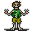

# { .sprite } Rancid zombie

**Found in:** Foaming Flask Tavern: [oldcave0](../maps/oldcave0.md), Foaming Flask Tavern: [oldcave1](../maps/oldcave1.md), Foaming Flask Tavern: [roadbeforecrossroads9](../maps/roadbeforecrossroads9.md)

<div class="infobox" markdown>

<p class="ib-img">{ .sprite }</p>

| | |
|---|---|
| **Type** | Enemy (hostile on sight) |
| **Found in** | Foaming Flask Tavern |
| **Class** | Undead |
| **HP** | 26 |
| **XP when defeated** | 92 |
| **Entry ID** | `zombie1` |
| **Introduced** | v0.7.0 or earlier |

</div>

## Combat statistics

| Statistic | Value |
|---|---|
| Class | Undead |
| HP | 26 |
| XP when defeated | 92 |
| Damage | 4 to 7 |
| Attack chance | 83 |
| Block chance | 47 |
| Damage resistance | 3 |
| Max AP | 10 |
| Attack cost | 3 AP |
| Attacks per turn | 3 |
| Move cost | 5 AP |
| Critical skill | 20 |
| Critical multiplier | 3.0 |
| Critical hit chance | 15% |


<p class="verified">Verified against v0.8.18 monster data and game code (`MonsterTypeParser.java`).</p>

## Drops

| Item | Chance | Qty |
|---|---|---|
| [Gold coins](../items/gold.md) | 70% | 5 to 23 |
| [Ruby gem](../items/gem2.md) | 25% | 1 |
| [Regular potion of health](../items/health.md) | 25% | 1 |
| [Iron sword](../items/ironsword1.md) | 10% | 1 |

## Locations

| Map | Region | Up to | Notes |
|---|---|---|---|
| [oldcave0](../maps/oldcave0.md) | Foaming Flask Tavern | 11 | – |
| [oldcave1](../maps/oldcave1.md) | Foaming Flask Tavern | 6 | – |
| [roadbeforecrossroads9](../maps/roadbeforecrossroads9.md) | Foaming Flask Tavern | 7 | – |


## Version history

| Version | Change |
|---|---|
| [v0.7.0](../versions/0.7.0.md) | Present in v0.7.0 (earliest release tracked) |
| [v0.7.2](../versions/0.7.2.md) | minor data change |

<p class="verified">Verified against v0.8.18 and every earlier release back to v0.7.0 (game data compared release by release).</p>


??? info "Technical information"

    | | |
    |---|---|
    | Entry ID | `zombie1` |
    | Spawn group | `zombie2` |
    | Loot table | `undead1` |
    | Conversation | – |
    | Faction | – |
    | Movement | – |
    | Icon | `monsters_tometik8:25` |
    | Defined in | `res/raw/monsterlist_v070_oldcave.json` |

    Raw data:

    ```json
    {
     "id": "zombie1",
     "name": "Rancid zombie",
     "iconID": "monsters_tometik8:25",
     "maxHP": 26,
     "moveCost": 5,
     "monsterClass": "undead",
     "attackDamage": {
      "min": 4,
      "max": 7
     },
     "spawnGroup": "zombie2",
     "droplistID": "undead1",
     "attackCost": 3,
     "attackChance": 83,
     "criticalSkill": 20,
     "criticalMultiplier": 3.0,
     "blockChance": 47,
     "damageResistance": 3
    }
    ```


??? info "How the XP value is calculated"

    The game computes each enemy's experience value when it loads the data (`MonsterTypeParser.java`):

    XP = ⌈(attacks per turn × attack chance × average damage × (1 + critical skill × critical multiplier) × 3 + HP × (1 + block chance) + 9 × damage resistance) × 0.7⌉

    Percentages are used as fractions (e.g. 60% = 0.6). Enemies whose attacks inflict a condition are worth 50 XP more. The More Exp skill adds a percentage on top.


## Community notes

<small>Written by players, not generated from game data. **Observations**: what players notice in-game · **Lore**: the in-world story · **Trivia**: real-world facts, references, development history · **Theory / speculation**: unconfirmed ideas; may just be unfinished content</small>

### Observations

*No notes yet. Contributions are welcome: [add a note](https://github.com/asdfghjkl628/Andor-s-Trail-Wikiiii/new/main/notes/monsters?filename=zombie1.md&value=%23%23%20Observations%0A%0A%3C%21--%20what%20players%20notice%20in-game%20--%3E%0A%0A%23%23%20Lore%0A%0A%3C%21--%20the%20in-world%20story%20--%3E%0A%0A%23%23%20Trivia%0A%0A%3C%21--%20real-world%20facts%2C%20references%2C%20development%20history%20--%3E%0A%0A%23%23%20Theory%20/%20speculation%0A%0A%3C%21--%20unconfirmed%20ideas%3B%20may%20just%20be%20unfinished%20content%20--%3E%0A).*

### Lore

*No notes yet. Contributions are welcome: [add a note](https://github.com/asdfghjkl628/Andor-s-Trail-Wikiiii/new/main/notes/monsters?filename=zombie1.md&value=%23%23%20Observations%0A%0A%3C%21--%20what%20players%20notice%20in-game%20--%3E%0A%0A%23%23%20Lore%0A%0A%3C%21--%20the%20in-world%20story%20--%3E%0A%0A%23%23%20Trivia%0A%0A%3C%21--%20real-world%20facts%2C%20references%2C%20development%20history%20--%3E%0A%0A%23%23%20Theory%20/%20speculation%0A%0A%3C%21--%20unconfirmed%20ideas%3B%20may%20just%20be%20unfinished%20content%20--%3E%0A).*

### Trivia

*No notes yet. Contributions are welcome: [add a note](https://github.com/asdfghjkl628/Andor-s-Trail-Wikiiii/new/main/notes/monsters?filename=zombie1.md&value=%23%23%20Observations%0A%0A%3C%21--%20what%20players%20notice%20in-game%20--%3E%0A%0A%23%23%20Lore%0A%0A%3C%21--%20the%20in-world%20story%20--%3E%0A%0A%23%23%20Trivia%0A%0A%3C%21--%20real-world%20facts%2C%20references%2C%20development%20history%20--%3E%0A%0A%23%23%20Theory%20/%20speculation%0A%0A%3C%21--%20unconfirmed%20ideas%3B%20may%20just%20be%20unfinished%20content%20--%3E%0A).*

### Theory / speculation

*No notes yet. Contributions are welcome: [add a note](https://github.com/asdfghjkl628/Andor-s-Trail-Wikiiii/new/main/notes/monsters?filename=zombie1.md&value=%23%23%20Observations%0A%0A%3C%21--%20what%20players%20notice%20in-game%20--%3E%0A%0A%23%23%20Lore%0A%0A%3C%21--%20the%20in-world%20story%20--%3E%0A%0A%23%23%20Trivia%0A%0A%3C%21--%20real-world%20facts%2C%20references%2C%20development%20history%20--%3E%0A%0A%23%23%20Theory%20/%20speculation%0A%0A%3C%21--%20unconfirmed%20ideas%3B%20may%20just%20be%20unfinished%20content%20--%3E%0A).*


<small>Data from v0.8.18</small>
