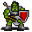

# { .sprite } Zortak barbarian

<div class="infobox" markdown>

<p class="ib-img">{ .sprite }</p>

| | |
|---|---|
| **Monster ID** | `zortak4` |
| **Type** | Enemy |
| **Class** | Giant |
| **HP** | 207 |
| **XP when killed** | 337 |
| **Found in** | lodar18, lodar8 |
| **Introduced** | v0.7.0 or earlier |

</div>

## Combat stats

| Stat | Value |
|---|---|
| HP | 207 |
| Damage | 3 to 11 |
| Attack chance | 178 |
| Block chance | 79 |
| Damage resistance | 5 |
| Max AP | 10 |
| Attack cost | 6 AP |
| Attacks per turn | 1 |
| Move cost | 5 AP |
| Critical skill | 25 |
| Critical multiplier | 3.0 |
| Crit chance | 17% |

**XP formula** (from the game's loader): ⌈(attacks per turn × attack chance × average damage × (1 + critical skill × multiplier) × 3 + HP × (1 + block chance) + 9 × damage resistance) × 0.7⌉, +50 if its hits inflict a condition. More Exp adds a percentage on top.

<p class="verified">Verified against v0.8.18 monster data and game code (`MonsterTypeParser.java`).</p>


## Drops

| Item | Chance | Qty |
|---|---|---|
| [Gold coins](../items/gold.md) | 30% | 1 to 5 |
| [Regular potion of health](../items/health.md) | 10% | 1 |
| [Heavy iron gloves](../items/hglv_irn.md) | 5% | 1 |
| [Claymore of the warlord](../items/clmr_wrld.md) | 1% | 1 |
| [Mundane necklace](../items/junk_necklace0.md) | 5% | 1 |

## Locations

| Map | Region | Up to | Notes |
|---|---|---|---|
| [lodar18](../maps/lodar18.md) | – | 1 | – |
| [lodar8](../maps/lodar8.md) | – | 12 | – |


## Version history

| Version | Change |
|---|---|
| [v0.7.0](../versions/0.7.0.md) | Present in v0.7.0 (earliest release tracked) |
| [v0.7.2](../versions/0.7.2.md) | minor data change |

<p class="verified">Verified against v0.8.18 and every earlier release back to v0.7.0 (game data compared release by release).</p>


## Community notes

<small>Written by players, not generated from game data. **Observations**: what players notice in-game · **Lore**: the in-world story · **Trivia**: real-world facts, references, development history · **Theory / speculation**: unconfirmed ideas; may just be unfinished content</small>

### Observations

*Nothing here yet. Know something? [Add it](https://github.com/asdfghjkl628/Andor-s-Trail-Wikiiii/new/main/notes/monsters?filename=zortak4.md&value=%23%23%20Observations%0A%0A%3C%21--%20what%20players%20notice%20in-game%20--%3E%0A%0A%23%23%20Lore%0A%0A%3C%21--%20the%20in-world%20story%20--%3E%0A%0A%23%23%20Trivia%0A%0A%3C%21--%20real-world%20facts%2C%20references%2C%20development%20history%20--%3E%0A%0A%23%23%20Theory%20/%20speculation%0A%0A%3C%21--%20unconfirmed%20ideas%3B%20may%20just%20be%20unfinished%20content%20--%3E%0A).*

### Lore

*Nothing here yet. Know something? [Add it](https://github.com/asdfghjkl628/Andor-s-Trail-Wikiiii/new/main/notes/monsters?filename=zortak4.md&value=%23%23%20Observations%0A%0A%3C%21--%20what%20players%20notice%20in-game%20--%3E%0A%0A%23%23%20Lore%0A%0A%3C%21--%20the%20in-world%20story%20--%3E%0A%0A%23%23%20Trivia%0A%0A%3C%21--%20real-world%20facts%2C%20references%2C%20development%20history%20--%3E%0A%0A%23%23%20Theory%20/%20speculation%0A%0A%3C%21--%20unconfirmed%20ideas%3B%20may%20just%20be%20unfinished%20content%20--%3E%0A).*

### Trivia

*Nothing here yet. Know something? [Add it](https://github.com/asdfghjkl628/Andor-s-Trail-Wikiiii/new/main/notes/monsters?filename=zortak4.md&value=%23%23%20Observations%0A%0A%3C%21--%20what%20players%20notice%20in-game%20--%3E%0A%0A%23%23%20Lore%0A%0A%3C%21--%20the%20in-world%20story%20--%3E%0A%0A%23%23%20Trivia%0A%0A%3C%21--%20real-world%20facts%2C%20references%2C%20development%20history%20--%3E%0A%0A%23%23%20Theory%20/%20speculation%0A%0A%3C%21--%20unconfirmed%20ideas%3B%20may%20just%20be%20unfinished%20content%20--%3E%0A).*

### Theory / speculation

*Nothing here yet. Know something? [Add it](https://github.com/asdfghjkl628/Andor-s-Trail-Wikiiii/new/main/notes/monsters?filename=zortak4.md&value=%23%23%20Observations%0A%0A%3C%21--%20what%20players%20notice%20in-game%20--%3E%0A%0A%23%23%20Lore%0A%0A%3C%21--%20the%20in-world%20story%20--%3E%0A%0A%23%23%20Trivia%0A%0A%3C%21--%20real-world%20facts%2C%20references%2C%20development%20history%20--%3E%0A%0A%23%23%20Theory%20/%20speculation%0A%0A%3C%21--%20unconfirmed%20ideas%3B%20may%20just%20be%20unfinished%20content%20--%3E%0A).*


??? info "Technical information"

    | | |
    |---|---|
    | Monster ID | `zortak4` |
    | Spawn group | `zortak2` |
    | Loot table | `zortak` |
    | Conversation | – |
    | Faction | – |
    | Movement | helpOthers |
    | Icon | `monsters_tometik7:87` |
    | Defined in | `res/raw/monsterlist_v070_lodarmaze.json` |

    Raw data:

    ```json
    {
     "id": "zortak4",
     "name": "Zortak barbarian",
     "iconID": "monsters_tometik7:87",
     "maxHP": 207,
     "moveCost": 5,
     "monsterClass": "giant",
     "movementAggressionType": "helpOthers",
     "attackDamage": {
      "min": 3,
      "max": 11
     },
     "spawnGroup": "zortak2",
     "droplistID": "zortak",
     "attackCost": 6,
     "attackChance": 178,
     "criticalSkill": 25,
     "criticalMultiplier": 3.0,
     "blockChance": 79,
     "damageResistance": 5
    }
    ```


<small>Data from v0.8.18</small>
