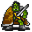

# { .sprite } Zortak leader

<div class="infobox" markdown>

<p class="ib-img">{ .sprite }</p>

| | |
|---|---|
| **Monster ID** | `zortakb` |
| **Type** | NPC |
| **Class** | Giant |
| **HP** | 279 |
| **XP when killed** | 623 |
| **Found in** | lodar8 |
| **Introduced** | v0.7.0 or earlier |

</div>

## Combat stats

| Stat | Value |
|---|---|
| HP | 279 |
| Damage | 9 |
| Attack chance | 185 |
| Block chance | 125 |
| Damage resistance | 0 |
| Max AP | 10 |
| Attack cost | 5 AP |
| Attacks per turn | 2 |
| Move cost | 5 AP |
| Critical skill | 30 |
| Critical multiplier | 3.0 |
| Crit chance | 19% |

**On hit:** On target: Dazed (magnitude 2, 4 rounds, 20% chance)

**XP formula** (from the game's loader): ⌈(attacks per turn × attack chance × average damage × (1 + critical skill × multiplier) × 3 + HP × (1 + block chance) + 9 × damage resistance) × 0.7⌉, +50 if its hits inflict a condition. More Exp adds a percentage on top.

<p class="verified">Verified against v0.8.18 monster data and game code (`MonsterTypeParser.java`).</p>


## Drops

| Item | Chance | Qty |
|---|---|---|
| [Gold coins](../items/gold.md) | 100% | 50 to 100 |
| [Regular potion of health](../items/health.md) | 100% | 2 |
| [Serpent's hauberk](../items/haub_serp.md) | 100% | 1 |

## Locations

| Map | Region | Up to | Notes |
|---|---|---|---|
| [lodar8](../maps/lodar8.md) | – | 1 | – |


## Dialogue simulator

Set up your situation (quest stages, items, kills…), then talk to Zortak leader. The simulator follows the game's own rules: it takes the same silent checks, offers only the options you'd really see, and applies their effects (quest stages, items handed over, rewards) as you go.

<div class="dlg-sim" data-src="../../assets/dialogue/zortakb.json" data-npc="Zortak leader" markdown="0"><noscript>The simulator needs JavaScript. The full dialogue is listed below.</noscript></div>

<p class="verified">Rules verified against v0.8.18 game code (ConversationController.java) and dialogue data.</p>

??? quote "Dialogue (1 lines)"

    *What the dialogue says, exactly as in the game files. Lines are listed once; links jump to the line a choice leads to.*

    <span id="d-zortakb"></span>**`zortakb`** Zortak leader: “The zortak will defeat you!”

    - “Fight!” → *fight starts*


## Version history

| Version | Change |
|---|---|
| [v0.7.0](../versions/0.7.0.md) | Present in v0.7.0 (earliest release tracked) |
| [v0.7.2](../versions/0.7.2.md) | hitEffect: {"conditionsTarget": [{"chance": 20, "c… → {"conditionsTarget": [{"chance": "20", …<br>Dialogue: 1 line changed<br>· text: “The Zortak will defeat you!” → “The zortak will defeat you!” |

<p class="verified">Verified against v0.8.18 and every earlier release back to v0.7.0 (game data compared release by release).</p>


## Community notes

<small>Written by players, not generated from game data. **Observations**: what players notice in-game · **Lore**: the in-world story · **Trivia**: real-world facts, references, development history · **Theory / speculation**: unconfirmed ideas; may just be unfinished content</small>

### Observations

*Nothing here yet. Know something? [Add it](https://github.com/asdfghjkl628/Andor-s-Trail-Wikiiii/new/main/notes/monsters?filename=zortakb.md&value=%23%23%20Observations%0A%0A%3C%21--%20what%20players%20notice%20in-game%20--%3E%0A%0A%23%23%20Lore%0A%0A%3C%21--%20the%20in-world%20story%20--%3E%0A%0A%23%23%20Trivia%0A%0A%3C%21--%20real-world%20facts%2C%20references%2C%20development%20history%20--%3E%0A%0A%23%23%20Theory%20/%20speculation%0A%0A%3C%21--%20unconfirmed%20ideas%3B%20may%20just%20be%20unfinished%20content%20--%3E%0A).*

### Lore

*Nothing here yet. Know something? [Add it](https://github.com/asdfghjkl628/Andor-s-Trail-Wikiiii/new/main/notes/monsters?filename=zortakb.md&value=%23%23%20Observations%0A%0A%3C%21--%20what%20players%20notice%20in-game%20--%3E%0A%0A%23%23%20Lore%0A%0A%3C%21--%20the%20in-world%20story%20--%3E%0A%0A%23%23%20Trivia%0A%0A%3C%21--%20real-world%20facts%2C%20references%2C%20development%20history%20--%3E%0A%0A%23%23%20Theory%20/%20speculation%0A%0A%3C%21--%20unconfirmed%20ideas%3B%20may%20just%20be%20unfinished%20content%20--%3E%0A).*

### Trivia

*Nothing here yet. Know something? [Add it](https://github.com/asdfghjkl628/Andor-s-Trail-Wikiiii/new/main/notes/monsters?filename=zortakb.md&value=%23%23%20Observations%0A%0A%3C%21--%20what%20players%20notice%20in-game%20--%3E%0A%0A%23%23%20Lore%0A%0A%3C%21--%20the%20in-world%20story%20--%3E%0A%0A%23%23%20Trivia%0A%0A%3C%21--%20real-world%20facts%2C%20references%2C%20development%20history%20--%3E%0A%0A%23%23%20Theory%20/%20speculation%0A%0A%3C%21--%20unconfirmed%20ideas%3B%20may%20just%20be%20unfinished%20content%20--%3E%0A).*

### Theory / speculation

*Nothing here yet. Know something? [Add it](https://github.com/asdfghjkl628/Andor-s-Trail-Wikiiii/new/main/notes/monsters?filename=zortakb.md&value=%23%23%20Observations%0A%0A%3C%21--%20what%20players%20notice%20in-game%20--%3E%0A%0A%23%23%20Lore%0A%0A%3C%21--%20the%20in-world%20story%20--%3E%0A%0A%23%23%20Trivia%0A%0A%3C%21--%20real-world%20facts%2C%20references%2C%20development%20history%20--%3E%0A%0A%23%23%20Theory%20/%20speculation%0A%0A%3C%21--%20unconfirmed%20ideas%3B%20may%20just%20be%20unfinished%20content%20--%3E%0A).*


??? info "Technical information"

    | | |
    |---|---|
    | Monster ID | `zortakb` |
    | Spawn group | `zortakb` |
    | Loot table | `zortakb` |
    | Conversation | `zortakb` |
    | Faction | – |
    | Movement | – |
    | Icon | `monsters_tometik7:85` |
    | Defined in | `res/raw/monsterlist_v070_lodarmaze.json` |

    Raw data:

    ```json
    {
     "id": "zortakb",
     "name": "Zortak leader",
     "iconID": "monsters_tometik7:85",
     "maxHP": 279,
     "moveCost": 5,
     "unique": 1,
     "monsterClass": "giant",
     "attackDamage": {
      "min": 9,
      "max": 9
     },
     "phraseID": "zortakb",
     "droplistID": "zortakb",
     "attackCost": 5,
     "attackChance": 185,
     "criticalSkill": 30,
     "criticalMultiplier": 3.0,
     "blockChance": 125,
     "hitEffect": {
      "conditionsTarget": [
       {
        "condition": "dazed",
        "magnitude": 2,
        "duration": 4,
        "chance": "20"
       }
      ]
     }
    }
    ```


<small>Data from v0.8.18</small>
