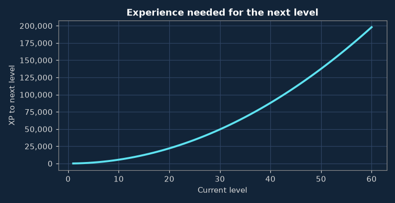
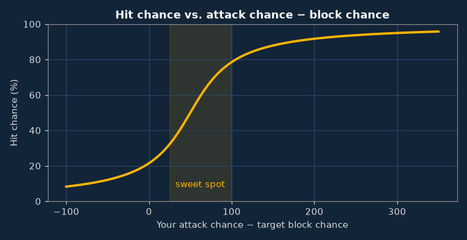
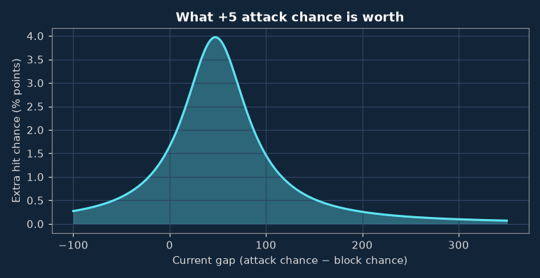
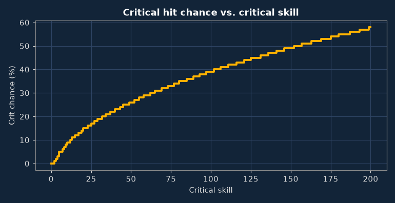
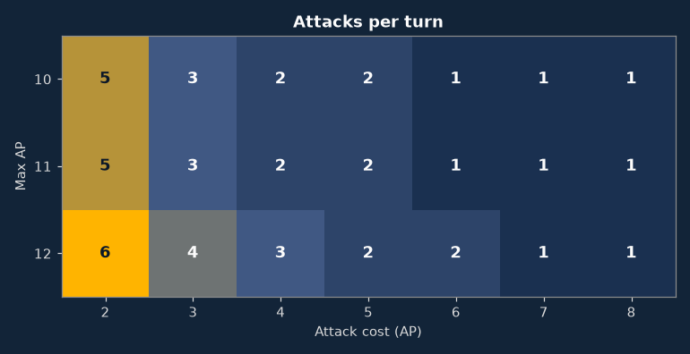

# Stats & Skills

How character statistics, levelling and combat work in v0.8.18, as implemented in the game's source code. Each section can be collapsed by clicking its heading. For recommendations on how to use this information, see [Strategy](../strategy/index.md).

???+ section "Starting stats (level 1)"

    | Stat | Lv 1 | Stat | Lv 1 |
    |---|---|---|---|
    | [Max HP](stats.md#max-hp) | 25 | [Critical skill](stats.md#critical-skill) | 0 |
    | [Max AP](stats.md#max-ap) | 10 | [Critical multiplier](stats.md#critical-multiplier) | – |
    | [Attack chance](stats.md#attack-chance) | 60 | [Attack cost](stats.md#attack-cost) | 4 AP |
    | [Attack damage](stats.md#attack-damage) | 1–1 | [Move cost](stats.md#move-cost) | 6 AP |
    | [Block chance](stats.md#block-chance) | 9 | [Use item cost](stats.md#use-item-cost) | 5 AP |
    | [Damage resistance](stats.md#damage-resistance) | 0 | [Re-equip cost](stats.md#re-equip-cost) | 5 AP |

???+ section "Levelling up"

    | Choice each level-up | Bonus |
    |---|---|
    | Max health | +5 HP |
    | Attack chance | +5 |
    | Attack damage | +1 min & max |
    | Block chance | +3 |

    One bonus is chosen at each level-up, and the choice is permanent (the game has no way to reallocate it). These choices form your **base stats**, which are the only values that skill requirements check. Bonuses from equipment and skills do not count toward requirements.

    **Skill points:** levels 4, 8, 12, 16, 20, 24, 28, 32, 36, 40, 44, 48, 52, 56, 60. That is 12 skill points by level 50.
    **Experience:** level L → L+1 costs 55 × L². The cost grows with the square of the level.

    

    For how the max health level-up compares with the [Fortitude](fortitude.md) skill, see [Strategy: Levelling & skill points](../strategy/levelling.md#fortitude-compared-with-the-max-health-level-up).

    | Level | Total XP | XP to next |
    |---|---|---|
    | 2 | 55 | 220 |
    | 5 | 1,650 | 1,375 |
    | 10 | 15,675 | 5,500 |
    | 15 | 55,825 | 12,375 |
    | 20 | 135,850 | 22,000 |
    | 25 | 269,500 | 34,375 |
    | 30 | 470,525 | 49,500 |
    | 40 | 1,129,700 | 88,000 |
    | 50 | 2,223,375 | 137,500 |
    | 60 | 3,861,550 | 198,000 |

???+ section "How combat works"

    Every attack is resolved in the same four steps, described below. The [stat glossary](stats.md) explains each stat.

    **1 · Hit?** `hit % = 50 × (1 + (2/π) × arctan((AC − BC − 50) / 40))`

    

    

    | AC − BC | Hit | +5 AC adds |
    |---|---|---|
    | -50 | 12% | +0.6% |
    | +0 | 21% | +1.7% |
    | +25 | 32% | +3.0% |
    | +50 | 50% | +4.0% |
    | +75 | 67% | +2.7% |
    | +100 | 78% | +1.5% |
    | +150 | 87% | +0.5% |
    | +200 | 91% | +0.3% |
    | +300 | 94% | +0.1% |

    **2 · Damage:** random between min and max attack damage.

    **3 · Critical?** Only if you have critical skill above 0 **and** a critical multiplier, which comes from your weapon (or from [Way of the Monk](fightstyleUnarmedUnarmored.md) when fighting unarmed). Without a multiplier, critical skill has no effect. Ghosts, constructs and demons are immune to critical hits. `crit % = −5 + 2 × √(5 × critical skill)`, then damage × multiplier.

    

    | Crit skill | Crit % |
    |---|---|
    | 5 | 5% |
    | 10 | 9% |
    | 20 | 15% |
    | 30 | 19% |
    | 45 | 25% |
    | 60 | 29% |
    | 80 | 35% |
    | 100 | 39% |
    | 150 | 49% |

    **4 · Armor:** the target's damage resistance is subtracted from the result, with a minimum of 0, so a hit can deal no damage at all.

    **Attacks per turn** = max AP ÷ attack cost, rounded down.

    

???+ section "All skills (45)"

    Abbreviations (AC, BC, DR…) are explained in the [glossary](../glossary.md).

    **Learned with skill points** (in the order the game lists them)

    | Skill | Max | Prerequisite | What it does |
    |---|---|---|---|
    | [Weapon Accuracy](weaponChance.md)\* | ∞ | – | +12 AC per level |
    | [Hard Hit](weaponDmg.md) | ∞ | – | +2 max dmg per level |
    | [Merchant](barter.md)\* | 3 | – | Shop price penalty −4 points per level (better buy and sell prices) |
    | [Dodge](dodge.md)\* | ∞ | – | +9 BC per level |
    | [Bark Skin](barkSkin.md) | 5 | Lv 10+ · Base block chance 15+ | +1 DR per level |
    | [More Criticals](moreCriticals.md) | ∞ | – | +20% of equipment CS per level |
    | [Better Criticals](betterCriticals.md) | ∞ | [More Criticals](moreCriticals.md) 1 | +25% of equipment CM per level |
    | [Combat Speed](speed.md) | 2 | Lv 15+ | +1 max AP per level |
    | [Treasure Hunter](coinfinder.md)\* | ∞ | – | +30% chance of gold drops, +50% gold per drop, per level |
    | [Quick Learner](moreExp.md) | ∞ | – | +10% XP from kills per level |
    | [Cleave](cleave.md)\* | ∞ | [Weapon Accuracy](weaponChance.md) 1 · [Hard Hit](weaponDmg.md) 1 | +3 AP per kill per level |
    | [Corpse Eater](eater.md) | ∞ | Base max HP 40+ | +1 HP per kill per level |
    | [Increased Fortitude](fortitude.md)\* | ∞ | Lv 5+ | +1 max HP on every later level-up, per level |
    | [Evasion](evasion.md)\* | 4 | – | −5% flee failure and −5% chance of adjacent enemies attacking, per level |
    | [Regeneration](regeneration.md) | ∞ | Base max HP 30+ · [Increased Fortitude](fortitude.md) 1 | +1 HP per round when no enemy is adjacent, per level |
    | [Failure Mastery](lowerExploss.md) | 5 | – | −20% XP lost on death per level |
    | [Magic Finder](magicfinder.md)\* | ∞ | – | +50% chance of non-ordinary item drops per level |
    | [Strong Mind](resistanceMental.md) | 7 | – | −10% chance of mental conditions per level |
    | [Enduring Body](resistancePhysical.md) | 7 | – | −10% chance of physical conditions per level |
    | [Pure Blood](resistanceBlood.md) | 7 | – | −10% chance of blood conditions per level |
    | [Internal bleeding](crit1.md) | 1 | [More Criticals](moreCriticals.md) 2 · [Better Criticals](betterCriticals.md) 2 | 50% chance per crit to inflict Internal bleeding |
    | [Fracture](crit2.md) | 1 | [More Criticals](moreCriticals.md) 4 · [Better Criticals](betterCriticals.md) 4 · [Internal bleeding](crit1.md) 1 | 50% chance per crit to inflict Fracture |
    | [Rejuvenation](rejuvenation.md) | 1 | [Pure Blood](resistanceBlood.md) 3 · [Strong Mind](resistanceMental.md) 3 · [Enduring Body](resistancePhysical.md) 3 | 20% chance per round to weaken one harmful condition |
    | [Taunt](taunt.md) | 1 | [Evasion](evasion.md) 2 · [Dodge](dodge.md) 4 | 75% chance that an enemy who misses you loses 2 AP |
    | [Concussion](concussion.md) | 1 | [Combat Speed](speed.md) 2 · [Weapon Accuracy](weaponChance.md) 3 · [Hard Hit](weaponDmg.md) 5 | 15% chance to inflict Concussion when your AC exceeds the target's BC by 50+ |
    | [Fighting style: Dual wield](fightstyleDualWield.md) | 2 | Lv 15+ | Off-hand weapon counts 50% (level 1) or 100% (level 2), up from 25% |
    | [Fighting style: Two-handed weapon](fightstyle2hand.md) | 2 | Lv 15+ | Two-handed weapons: +30% of weapon dmg per level |
    | [Fighting style: Weapon and shield](fightstyleWeaponShield.md) | 2 | Lv 15+ | Weapon + shield: +25% of weapon AC and +25% of shield BC per level |
    | [Fighting style: Way of the monk](fightstyleUnarmedUnarmored.md) | 3 | Lv 15+ | No weapon, shield or armor: +12 AC, +5 BC, +1 DR, +4 max dmg per level; CM ×(1 + 0.25 per level) |
    | [Specialization: Dual wield](specializationDualWield.md) | 1 | Lv 45+ · [Fighting style: Dual wield](fightstyleDualWield.md) 2 | Both weapons: +50% of their AC and +50% of their BC |
    | [Specialization: Two-handed weapon](specialization2hand.md) | 1 | Lv 45+ · [Fighting style: Two-handed weapon](fightstyle2hand.md) 2 | Two-handed weapon: +50% of its dmg, +20% of its AC |
    | [Specialization: Weapon and shield](specializationWeaponShield.md) | 1 | Lv 45+ · [Fighting style: Weapon and shield](fightstyleWeaponShield.md) 2 | Main-hand weapon: +50% of its AC, +20% of its dmg |

    \* Some quests also reward a level of this skill directly, without spending a skill point.

    **Unlocked through quests**

    | Skill | Max | Prerequisite | What it does |
    |---|---|---|---|
    | [Dark blessing of the Shadow](shadowBless.md) | 1 | Quest only | −5% chance of all conditions |
    | [Dagger proficiency](weaponProficiencyDagger.md) | 3 | First level from a quest, then skill points | Daggers, shortswords: +30% of weapon AC and BC, +10% of its CS, per level |
    | [One-handed sword proficiency](weaponProficiency1hsword.md) | 3 | First level from a quest, then skill points | Longswords, broadswords, rapiers: +30% of weapon AC and BC, +10% of its CS, per level |
    | [Two-handed sword proficiency](weaponProficiency2hsword.md) | 3 | First level from a quest, then skill points | Two-handed swords: +30% of weapon AC and BC, +10% of its CS, per level |
    | [Axe proficiency](weaponProficiencyAxe.md) | 3 | First level from a quest, then skill points | Axes, greataxes: +30% of weapon AC and BC, +10% of its CS, per level |
    | [Blunt weapon proficiency](weaponProficiencyBlunt.md) | 3 | First level from a quest, then skill points | Blunt weapons: +30% of weapon AC and BC, +10% of its CS, per level |
    | [Unarmed fighting](weaponProficiencyUnarmed.md) | 3 | First level from a quest, then skill points | No weapon or shield: +20 AC, +2 dmg, +5 BC per level |
    | [Pole weapon proficiency](weaponProficiencyPole.md) | 3 | First level from a quest, then skill points | Pole weapons: +30% of weapon AC and BC, +10% of its CS, per level |
    | [Shield proficiency](armorProficiencyShield.md) | 2 | First level from a quest, then skill points | With a shield or parrying weapon: +1 DR per level |
    | [Unarmored fighting](armorProficiencyUnarmored.md) | 3 | First level from a quest, then skill points | No armor: +10 BC per level |
    | [Light armor proficiency](armorProficiencyLight.md) | 3 | First level from a quest, then skill points | Light armor: +30% of its BC per level |
    | [Heavy armor proficiency](armorProficiencyHeavy.md) | 4 | First level from a quest, then skill points | Heavy armor: +20% of its BC, −25% of its AP-cost penalties, per level |
    | [Spore poison immunity](sporeImmunity.md) | 1 | Quest only | Immune to Spore poisoning |
