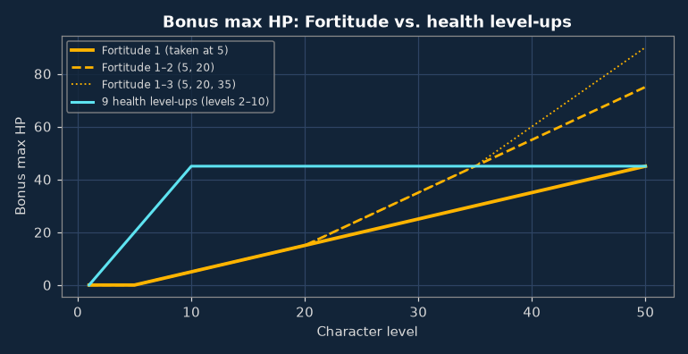

# Levelling & skill points

*Written for v0.8.18. Mechanics: [Stats & Skills](../skills/index.md). Abbreviations: [Glossary](../glossary.md).*

??? section "Summary"

    - **Avoid the max health level-up.** Learn [Fortitude](../skills/fortitude.md) at level 5 instead.
    - **Hold the level-4 skill point until level 5** for Fortitude.
    - **Take two block chance level-ups early** so that [Bark Skin](../skills/barkSkin.md) is available at level 10.
    - **Spend the remaining level-ups on attack chance and attack damage**, with more emphasis on damage later in the game.
    - **Plan skill points around the skills you intend to learn.** Many skills require a minimum character level, and skill points cannot be reallocated.

???+ section "Fortitude compared with the max health level-up"

    The **max health** level-up gives +5 HP, once. [Fortitude](../skills/fortitude.md) gives +1 HP per skill level on every level-up *after* it is learned. **It is NOT retroactive.** Each level of Fortitude needs a higher character level (5, 20, 35, 50, 65 and so on).

    **A thought experiment.** Imagine a hero who takes max health at every single level-up. ~~Why tf would you do this~~ How does Fortitude compare then?

    

    | Character level | Every level-up into health | Fortitude 1 | Fortitude 1–2 | Fortitude 1–3 | Fortitude 1–4 | Fortitude 1–6 |
    |---|---|---|---|---|---|---|
    | 20 | +95 | +15 | +15 | +15 | +15 | +15 |
    | 35 | +170 | +30 | +45 | +45 | +45 | +45 |
    | 50 | +245 | +45 | +75 | +90 | +90 | +90 |
    | 70 | +345 | +65 | +115 | +150 | +170 | +175 |
    | 100 | +495 | +95 | +175 | +240 | +290 | +345 |

    In raw HP, the all-health hero wins for a long time. Fortitude taken at every opportunity only catches up at **level 144**, after ten skill points and about 54 million XP. ~~The all-health hero has, by then, missed every attack since level 2.~~

    Now count what each option costs:

    | Option | Cost | HP by level 50 | HP per unit of cost |
    |---|---|---|---|
    | Every level-up into health | 49 level-ups | +245 | 5 per level-up |
    | Fortitude 1 (level 5) | 1 skill point | +45 | 45 per skill point |
    | Fortitude 2 (level 20) | 1 skill point | +30 | 30 per skill point |
    | Fortitude 3 (level 35) | 1 skill point | +15 | 15 per skill point |

    The all-health hero spends all 49 level-ups on those 245 HP, instead of, say, +245 attack chance or +49 damage. Fortitude 1 gives 45 HP for **one** skill point and leaves every level-up free. One point at level 5 is worth nine health level-ups by level 50, which is why the usual advice is: take Fortitude early, skip the health level-up.

    Later levels pay off less, because they arrive later. Fortitude 2 (level 20) is worth six health level-ups by level 50, Fortitude 3 (level 35) three, and Fortitude 4 can't be learned before level 50 at all. Whether they deserve a skill point depends on how far past 50 you plan to play.

    Your first skill point arrives at level 4, but Fortitude needs level 5, so hold that point for one level.

    Exception: a rough early stretch where +5 HP *now* beats +45 HP *eventually*. Potions usually cover that.

    Bonus: Fortitude counts toward [Regeneration](../skills/regeneration.md) (needs Fortitude + 30 base max HP per level). Start at 25 HP, take Fortitude at 5, and you hit 30 base HP at level 10 without a single health level-up.

???+ section "Block chance and Bark Skin"

    [Bark Skin](../skills/barkSkin.md): +1 DR per level, max 5. Each level needs character level 10 × skill level **and** base BC 15 × skill level. Only BC from level-ups counts ~~your shiny shield doesn't~~. You start at 9 BC; each BC level-up adds +3:

    | Bark Skin level | Character level | Base BC | BC level-ups needed (total) |
    |---|---|---|---|
    | 1 | 10 | 15 | 2 |
    | 2 | 20 | 30 | 7 |
    | 3 | 30 | 45 | 12 |
    | 4 | 40 | 60 | 17 |
    | 5 | 50 | 75 | 22 |

    Level 1 is cheap: two BC level-ups before level 10. Each further level costs five more level-ups plus a skill point, so decide early how far you're going. BC has few other sources ([Dodge](../skills/dodge.md), shields, armor), so spare BC level-ups are rarely wasted.

???+ section "Attack chance vs. attack damage"

    - **AC** (+5 per level-up) follows the [hit chance curve](../skills/index.md): great around 50 above the enemy's BC, nearly pointless far beyond it. Matters most early, before gear and proficiencies hand it out. Need more later? [Weapon Accuracy](../skills/weaponChance.md) gives +12 per point.
    - **Damage** (+1 min and max per level-up) never stops being useful: +1 on every hit, which adds up fast against high-DR enemies. Lean into it more as the game goes on.

???+ section "Skill point timeline"

    One skill point every 4 levels: 12 by level 50, against 49 level-ups. Most good skills are level-gated, so plan ahead:

    | Goal | Earliest level | Notes |
    |---|---|---|
    | [Fortitude](../skills/fortitude.md) 1 | 5 | The held level-4 point. |
    | [Bark Skin](../skills/barkSkin.md) 1 | 10 | Needs two BC level-ups. |
    | [Combat Speed](../skills/speed.md) 1 / 2 | 15 / 30 | +1 max AP each. Check your weapon's attack cost first ([why](combat.md)). |
    | A fighting style, levels 1 / 2 | 15 / 30 | Dual wield, two-handed, or weapon and shield. |
    | [Way of the Monk](../skills/fightstyleUnarmedUnarmored.md) 1 / 2 / 3 | 15 / 30 / 45 | No weapon, no armor. ~~No pants? Unconfirmed.~~ |
    | [Internal Bleeding](../skills/crit1.md) | 20 | 5 points total: More Criticals 2, Better Criticals 2, itself. |
    | [Fracture](../skills/crit2.md) | 40 | 10 points total: More/Better Criticals 4 each, Internal Bleeding, itself. |
    | A specialization | 45 | Needs the matching fighting style at level 2. |

    Crit skills do nothing without a critical multiplier (from your weapon, or [Way of the Monk](../skills/fightstyleUnarmedUnarmored.md) unarmed), and ghosts, constructs and demons ignore crits. Only sink 10 points into the crit chain if you're committed to a crit weapon.
